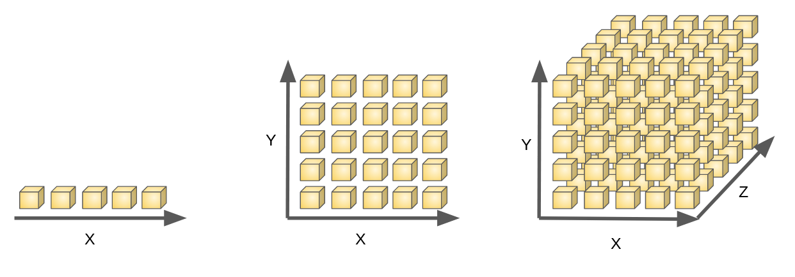
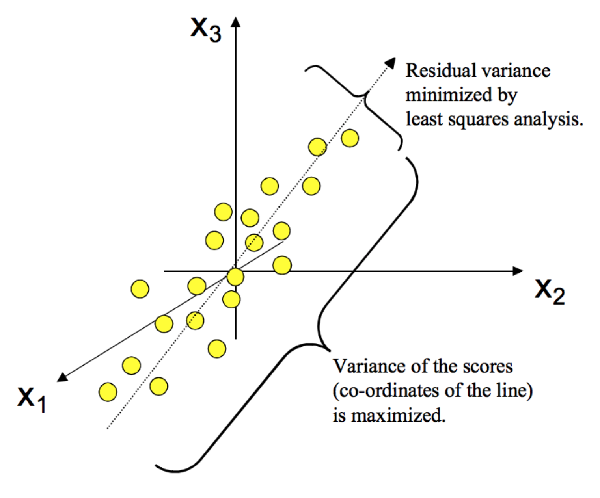
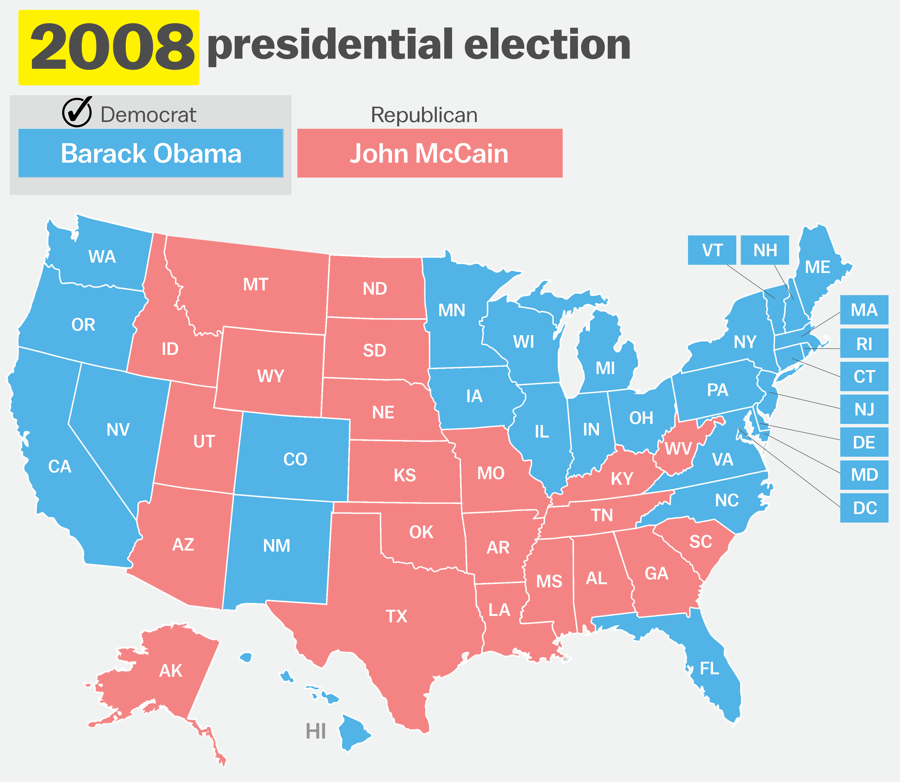
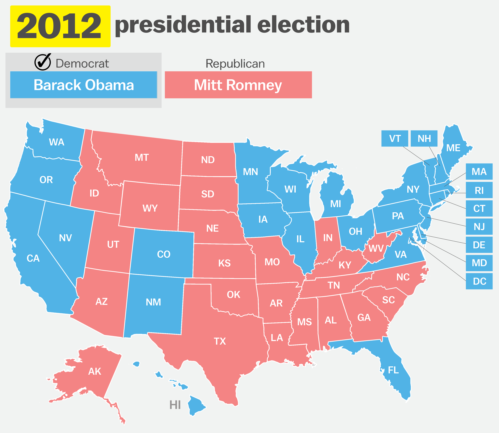

layout: true

<div class="my-footer">
  <span style="text-align:center">
    <span> 
      
    </span>
    <a href="https://therbootcamp.github.io/">
      <span style="padding-left:82px"> 
        <font color="#7E7E7E">
          www.therbootcamp.com
        </font>
      </span>
    </a>
    <a href="https://therbootcamp.github.io/">
      <font color="#7E7E7E">
       Applied Machine Learning with R | January 2019
      </font>
    </a>
    </span>
  </div> 

---

```{r, eval = TRUE, echo = FALSE, warning=F,message=F}
require(caret)
require(tidyverse)
# Code to knit slides
#bas = read_csv('1_Data/baselers.csv')
bas = read_csv('../../1_Data/baselers.csv')

sel = apply(bas, 1, function(x) any(is.na(unlist(x))))
bas = bas[!sel,]

bas = bas %>% 
  mutate_if(is.character, as.factor)

preprocesssing = preProcess(bas)
bas = predict(preprocesssing, bas)


bas <- bas %>%
  sample_n(1000)

bas <- bas %>% select_if(is.numeric)
baselers = bas

fitControl_cv <- trainControl(
  method = "repeatedcv",
  number = 1,
  repeats = 1)

train_index = createDataPartition(bas$income, p = .8, list = FALSE)
bas_train = bas %>% slice(train_index)
bas_test = bas %>% slice(-train_index)

income_lm = train(income ~ . - id, 
           method = 'lm', 
           data = bas_train)

income_lm_short = train(income ~ age + food + alcohol + happiness + fitness + datause + tattoos + weight + children + fitness + height, 
           method = 'lm', 
           data = bas_train)

```


```{r setup, include=FALSE}
options(htmltools.dir.version = FALSE)
# see: https://github.com/yihui/xaringan
# install.packages("xaringan")
# see: 
# https://github.com/yihui/xaringan/wiki
# https://github.com/gnab/remark/wiki/Markdown
options(width=110)
options(digits = 4)
```

```{r, echo = FALSE ,message = FALSE, warning = FALSE}
knitr::opts_chunk$set(comment=NA, fig.width=6, fig.height=6, echo = TRUE, eval = TRUE, 
                      message = FALSE, warning = FALSE, fig.align = 'center', dpi = 200)
library(tidyverse)
library(baselers)
library(ggthemes)
```


.pull-left45[

# Feature issues
<br>
<high>Too many features</high>

- Curse of dimensionality
- Feature importance

<high>Wrong features</high>

- Feature scaling
- Feature correlation
- Feature quality

<high>Create new features</high>

- Feature engineering

]

.pull-right45[

<p>
<br><br>

</p>

]

---

# Curse of dimensionality

.pull-left35[

As the number of features grows...

<high>Performance</high> - the amount of data that needs to generalize accurately grows exponentially.

<high>Efficiency</high> - the amount of computations grows (how much depends on the model).

<high>Redundancy</high> - the amount of redundancy grows (how much depends on the model). 

&#8594; <high>Small set of good predictors<high>

]

.pull-right6[

<p>
<br><br>

</p>

]

---

# How to reduce dimensionality?

.pull-left45[

<u>3 ways</u>

<i>A)</i> Reduce variables <high>manually</high> based on statistical or intuitive considerations.

<i>B)</i> Reduce variables <high>automatically</high> using the right ML algorithms, e.g., `random forests` or `lasso regression`, or feature selection algorithms, e.g., `recursive feature selection`.

<i>C)</i> Compress variables using <high>dimensionality reduction algorithms</high>, such as `principal component analysis` (PCA).

]

.pull-right5[

<p align = "center">

<font size=3>Interstellar<font>
</p>

]

---

# Feature importance

.pull-left4[

<high>Feature importance</high> characterizes how much a feature contributes to the fitting/prediction performance. 

Typically <high>normalized</high> to `[0, 100]`.

There are many <high>model specific metrics</high>.

<u>General strategies</u>
- Single variable prediction (e.g., using `LOESS`, `ROC`) 
- Accuracy loss from scrambling
- `random forests` importance
- etc.  
]

.pull-right5[
```{r, eval = FALSE}
# plot variable importance for lm(income ~ .)
plot(varImp(income_lm))
```

```{r, echo = FALSE, fig.height=5.2, fig.width=8}
plot(varImp(income_lm),col='#EA4B68',cex=1.3,scales = list(cex=1.3,lineheight=1.3),xlab=list(cex=1.5))
```

]

---

# `varImp()`

.pull-left45[
`varImp()` <high>automatically selects appropriate measure</high> of variable importance for a given algorithm. 

```{r eval = FALSE}
varImp(income_lm)
```

```{r echo = F}
varImp(income_lm_short)
```

]

.pull-right5[
```{r, eval = FALSE}
# plot variable importance for lm(income ~ .)
plot(varImp(income_lm))
```

```{r, echo = FALSE, fig.height=5.2, fig.width=8}
plot(varImp(income_lm),col='#EA4B68',cex=1.3,scales = list(cex=1.3,lineheight=1.3),xlab=list(cex=1.5))
```

]

---

# Recursive feature selection using `rfe()`

.pull-left35[

Algorithm(s) to <high>automatically select the best number of `n` predictors</high>, with `n` being selected from a set of candidate sets `N`, e.g., `N = [2,3,5,10]`, determined by the user. 
<br><br><br>
<u>Algorithm</u>
1. <high>Resample</high> and split data<br2>
2. Identify <high>best `n` predictors</high> and their prediction performance<br2>
3. <high>Aggregate performance</high> and select best `n` and the accordingly best predictors

]

.pull-right6[

```{r, eval = F}
# Run feature elimination
rfe(x = ..., y = ..., 
    sizes = c(3,4,5,10), # feature set sizes
    rfeControl = rfeControl(functions = lmFuncs))
```

```{r, echo = F}
# Run feature elimination
rfe(x = bas_train %>% select(-income), 
    y = bas_train$income,
    sizes = c(3,4,5,10),   # Features set sizes should be considered
    rfeControl = rfeControl(
      functions = lmFuncs,
      verbose = FALSE))
```

]

---

# Dimensionality reduction using `PCA`

.pull-left45[

The go-to algorithm for dimensionality is <high>principal component analysis</high> (PCA). 

PCA is an <high>unsupervised</high>, <high>regression-based</high> algorithm that re-represents the data in a <high>new feature space</high>.  

The new features aka <high>principal components are greedy</high> in that they attempt to explain as much variance as they can leaving as little as possible to other components.

<high>Skimming the best components off the top</high> results in a small number of features that <high>preserve the original features as well as possible</high>.

]


.pull-right45[

<p align = "center">

</p>

]

---

# Using `PCA`

.pull-left45[

```{r fig.height=5.2, fig.width=8, eval = F}
# train model WITHOUT PCA preprocessing
model = train(income ~ ., method = 'lm', 
           data = bas_train)

plot(varImp(model))
```

```{r fig.height=5.2, fig.width=8, echo = F}
# train model WITHOUT PCA preprocessing
model = train(income ~ . -id, method = 'lm', 
              data = bas_train)

plot(varImp(model, scale=F),col='#EA4B68',cex=1.3,scales = list(cex=1.3,lineheight=1.3),xlab=list(cex=1.5))
```


]

.pull-right45[

```{r fig.height=5.2, fig.width=8, eval = F}
# train model WITH PCA preprocessing
model = train(income ~ ., method = 'lm', 
              data = bas_train,
              preProc = c('pca'))
plot(varImp(model))
```

```{r fig.height=5.2, fig.width=8, echo = F}
# train model WITH PCA preprocessing
model = train(income ~ . -id, method = 'lm', 
              data = bas_train,
              preProc = c('pca'),
              trControl = trainControl(preProcOptions = list(thresh = 0.75)))
plot(varImp(model, scale=F),col='#EA4B68',cex=1.3,scales = list(cex=1.3,lineheight=1.3),xlab=list(cex=1.5))
```

]

---

# Other, easy feature problems

.pull-left45[

### Multi-collinearity

Multi-collinearity, <high>high feature correlations</high>, mean that there is redundancy in the data, which can lead to <high>less stable fits</high>, <high>uninterpretable variable importances</high>, and <high>worse predictions</high>.

```{r}
# identify redundant variables
findCorrelation(cor(baselers))

# remove from data
remove <- findCorrelation(cor(baselers))
baselers <- baselers %>%
  select(-remove)

```

]

.pull-right45[

### Unequal & low variance 

Unequal variance <high>breaks regularization</high> (L1, L2) and renders estimates difficult to interpret.

```{r, eval = F}
# standardize and center variables
train(..., preProc("center", "scale"))
```

Low variance variables add parameters, but <high>can hardly contribute to prediction</high> and are, thus, also redundant.

```{r}
# identify low variance variables
nearZeroVar(baselers)
```

]


---

# Difficult feature problems

<br>
.pull-left25[

1 <high>Trivial features</high> 

Successful prediction not necessarily implies that a meaningful pattern has been detected.

<br>
2 <high>Missing features</high>

Some problems are hard, requiring the engineering of new features. 

]


.pull-right65[
<br>
<p align="center">
  
</p>

]

---

# Trivial features

.pull-left3[

<u><a href="https://www.gwern.net/Tanks">An urban myth?!</a></u>

"The Army trained a program to differentiate American tanks from Russian tanks with 100% accuracy. Only later did analysts realize that the American tanks had been photographed on a sunny day and the Russian tanks had been photographed on a cloudy day. The computer had learned to detect brightness."<br><br>
New York Times <a href="https://www.nytimes.com/2017/10/09/science/stanford-sexual-orientation-study.html" style="font-size:8px">[Full text]</a>

]

.pull-right6[

<p align="center">
  
</p>

]


---

# Trivial features


In 2012, Nate Silver was praised to have correctly predicted the outcomes of the presidential election in 50 states after having correctly predicted 49 states in 2009. <high>But how much of a challenge was that?</high>

.pull-left5[

<p align="center">
  
</p>

]

.pull-right5[

<p align="center">
  
</p>

]

---

# (Always!) missing features

<high>Feature Engineering</high>

<i>"…some machine learning projects succeed and some fail. What makes the difference? Easily the most important factor is the features used."</i>

Pedro Domingos

<i>"The algorithms we used are very standard for Kagglers. […] We spent most of our efforts in feature engineering. [...] We were also very careful to discard features likely to expose us to the risk of over-fitting our model."</i>

Xavier Conort

<i>"Coming up with features is difficult, time-consuming, requires expert knowledge. "Applied machine learning" is basically feature engineering."</i>

Andrew Ng

---

# Feature engineering

.pull-left45[

<i>“Feature engineering is the process of <high>transforming raw data</high> into features that <high>better represent the underlying problem</high> to the predictive models, resulting in improved model accuracy on unseen data.”</i>

Jason Brownlee

<i>"...while avoiding the <high>curse of dimensionality</high>."</i>

duw

<u>Feature engineering involves</u>

- <high>Transformations</high>
- <high>Interactions</high>
- <high>New features</high>

]

.pull-right45[

<p align="center">
  
</p>

]

---

class: middle, center

<h1><a href="https://therbootcamp.github.io/appliedML_2019Jan/_sessions/Features/Features_practical.html">Practical</a></h1>

