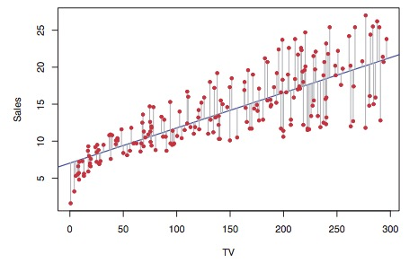
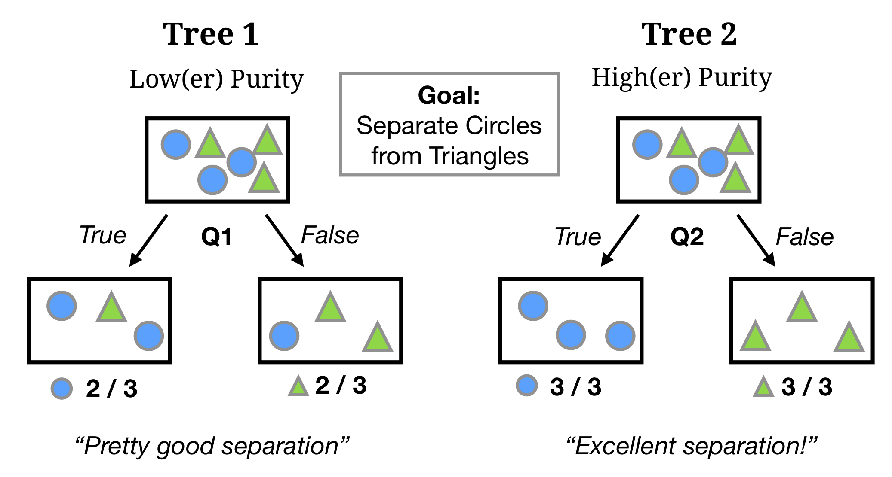
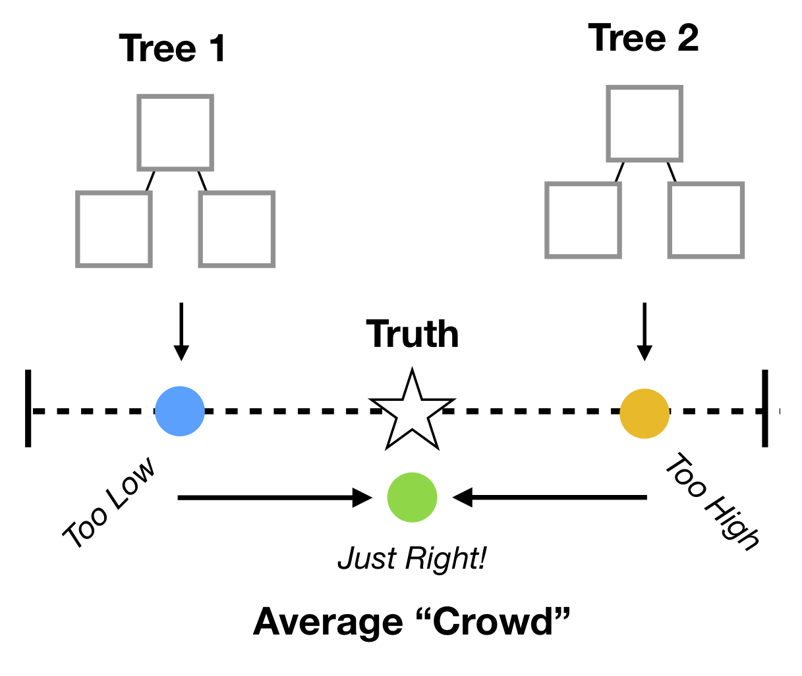

layout: true

<div class="my-footer"><span>
<a href="https://therbootcamp.github.io/"><font color="#7E7E7E">Applied Machine Learning with R, January 2019</font></a>
&emsp;&emsp;&emsp;&emsp;&emsp;&emsp;&emsp;&emsp;&emsp;&emsp;&emsp;&emsp;&emsp;&emsp;&emsp;&emsp;&emsp;&emsp;&emsp;&emsp;
<a href="https://therbootcamp.github.io/"><font color="#7E7E7E">www.therbootcamp.com</font></a>
</span></div> 

---


```{r, eval = TRUE, echo = FALSE, warning=F,message=F}
# Code to knit slides
baselers <- readr::read_csv("../_data/baselers.csv")

```


```{r setup, include=FALSE}
options(htmltools.dir.version = FALSE)
# see: https://github.com/yihui/xaringan
# install.packages("xaringan")
# see: 
# https://github.com/yihui/xaringan/wiki
# https://github.com/gnab/remark/wiki/Markdown
options(width=110)
options(digits = 4)
```

```{r, echo = FALSE ,message = FALSE, warning = FALSE}
knitr::opts_chunk$set(comment=NA, fig.width=6, fig.height=6, echo = TRUE, eval = TRUE, 
                      message = FALSE, warning = FALSE, fig.align = 'center', dpi = 200)
library(tidyverse)
library(baselers)
library(ggthemes)
library(ggpubr)
library(caret)
library(ISLR)
```


.pull-left4[

# Where we are at

- Have a business question
    - How can I predict loan default?

- Have data relevant to that question
    - Records from 300 historical customers

- Data is cleaned and in a tidy, rectangular format
    - Database, .csv,

## What's next?

<high>Select</high> and <high>train</high> model(s) depending on the <high>type of task</high>

]

.pull-right6[
<br><br><br>
```{r, echo = FALSE, fig.align = 'center', out.width = "100%", fig.cap = "Source: Medium.com"}
knitr::include_graphics("https://cdn-images-1.medium.com/max/1600/1*_QGyIwpgq831xI54cIe_GQ.jpeg")
```

]


---

.pull-left45[

# What type of task do you have?

There are many types of of ML tasks.

In this course, we will focus on 2 of the most popular

|Model|Description | Example |
|:----|:---- |:----|
|<high>Regression</high> (supervised)|Predicting a number|Stock prices|
|<high>Classification</high> (supervised)|Predicting a category, like whether|Whether someone will purchase a product or not|

]

.pull-right5[
<br><br><br>

```{r, echo = FALSE, fig.align = 'center', out.width = "100%"}
knitr::include_graphics("https://github.com/therbootcamp/appliedML_2019Jan/blob/master/_sessions/Fitting/image/class_v_regression.jpg?raw=true")
```

]

---

.pull-left45[

# What ML models are there?

There are *thousands* of machine learning models

In this course, you will learn 3 of the most popular:

|Model|Description|
|:----|:---- |
|Regression|A weighted linear combination of features and weights|
|Decision Tree|A series of hierarchical 'yes/no' decisions|
|Random Forests|Combination of many decision trees|

*In the Models session, you'll learn about many more!*

]

.pull-right5[

```{r, echo = FALSE, fig.align = 'center', out.width = "100%"}
knitr::include_graphics("https://github.com/therbootcamp/appliedML_2019Jan/blob/master/_sessions/Fitting/image/three_models_vert.jpg?raw=true")
```

]

---
class: center, middle

## Once you have a model you need to "Fit" (aka, "Train") it to data

```{r, echo = FALSE, out.width = "50%", fig.cap = "<font size = 4>James et al., Introduction to SL</font>"}

```

## What does that mean?


---


.pull-left5[

# What does "Fitting" mean?

For any model class, there is no "One" single model.

> How many possible Regression models are there?


Any machine learning model can be 'fit' (aka 'trained') on a specific dataset of interest.


Fitting means finding the "best" version of a model for a specific dataset.

> "Let me represent the data in the best way I can given how I work"<br>
>~ Model during fitting


The "best" model is usually defined as a combination of <high>accuracy</high> (higher better!) and <high>complexity</high> (lower better!)


]

.pull-right45[

```{r, echo = FALSE}
set.seed(101)
x <- rnorm(20)
y <- .7 * x + rnorm(20) + 10

data <- data.frame(x, y)

mod <- lm(y ~ x, data = data)

library(tidyverse)

three_mod <- ggplot(data, aes(x = x, y = y)) + geom_point() +
    theme_minimal()

  # geom_abline(slope = 2, intercept = 8, col = "blue", size = 1) +
  # geom_abline(slope = .2, intercept = 11, col = "red", size = 1) +
  # geom_abline(slope = mod$coefficients[2], intercept = mod$coefficients[1], col = "green", size = 1) +

```


<br><br>
### How do I fit a model to these data??

```{r, echo = FALSE, fig.width = 3, fig.height = 3, dpi = 200, out.width = "80%"}
three_mod
```


]


```{r, echo = FALSE}
set.seed(102)
x <- rnorm(10)
y <- .7 * x + rnorm(10, sd = .3) + 2

data <- data.frame(x, y)

mod <- lm(y ~ x, data = data)

great_intercept <- mod$coefficients[1]
great_slope <- mod$coefficients[2]

bad_intercept <- 3.5
bad_slope <- -.5

x0 = x
x1 = x
y0 = y
y1 = great_intercept + great_slope * x

dat_great <- data.frame(x0, x1, y0, y1)

x0 = x
x1 = x
y0 = y
y1 = bad_intercept + bad_slope * x

dat_bad <- data.frame(x0, x1, y0, y1)

library(tidyverse)

raw <- ggplot(dat_great, aes(x = x0, y = y0)) + geom_point(col = "blue") +
  theme_minimal() +
  xlim(c(-2, 3)) +
  ylim(c(0, 5)) +
  labs(title = "Raw Data", 
       x = "Feature", y = "Criterion")


great_raw <- ggplot(dat_great, aes(x = x0, y = y0)) + geom_point(col = "blue") +
  geom_abline(slope = great_slope, intercept = great_intercept, size = .5, linetype = 3) +
  theme_minimal() +
  xlim(c(-2, 3)) +
  ylim(c(0, 5)) +
  labs(title = "Model B", 
              subtitle = paste0("B0 = ", round(great_intercept, 2), ", B1 = ", round(great_slope, 2)),
       caption = paste("Mean Squared Error (MSE) = ?"),

       x = "Feature", y = "Criterion")

bad_raw <- ggplot(dat_bad, aes(x = x0, y = y0)) + geom_point(col = "blue") +
  geom_abline(slope = bad_slope, intercept = bad_intercept, size = .5, linetype = 3) +
  theme_minimal() +
  xlim(c(-2, 3)) +
  ylim(c(0, 5)) +
   labs(title = "Model A", 
        subtitle = paste0("B0 = ", round(bad_intercept, 2), ", B1 = ", round(bad_slope, 2)),
       caption = paste("Mean Squared Error (MSE) = ?"),
       x = "Feature", y = "Criterion")

great_err <- great_raw + 
  geom_linerange(data = dat_great, aes(x = x0, ymin = y0, ymax = y1), col = "red") +
  geom_point(data = dat_great, aes(x = x0, y = y1), col = "darkgreen", pch = "X", size = 3) +
    labs(title = "Model B - Better", 
       caption = paste("Mean Squared Error (MSE) = ", round(mean((dat_great$y1 - dat_great$y0) ^ 2), 2)),
       x = "Feature", y = "Criterion")

bad_err <- bad_raw +
    geom_linerange(data = dat_bad, aes(x = x0, ymin = y0, ymax = y1), col = "red") +
    geom_point(data = dat_bad, aes(x = x0, y = y1), col = "darkgreen", pch = "X", size = 3) +
   labs(title = "Model A - Worse", 
       caption = paste("Mean Squared Error (MSE) = ", round(mean((dat_bad$y1 - dat_bad$y0) ^ 2), 2)),
       x = "Feature", y = "Criterion")
```


---

.pull-left45[
<br><br><br>
# Defining Accuracy (or Error)

To train (fit) a model to a dataset, we need to <high>mathematically define Accuracy</high>

Alternatively, we can define a model's <high>Error</high>

There is <high>no 'correct'</high> definition of error, it depends on <high>what's important to you</high> as the decision maker!

Once accuracy (or error) is defined, a model can be trained to maximize (or minimize) it!

The model that minimizes error (or maximizes accuracy) is the final <high>Training model</high>

]

.pull-right45[

<br><br>
### How do I fit a model to these data??

```{r, echo = FALSE, fig.width = 3, fig.height = 3, dpi = 200, out.width = "80%"}
three_mod
```
]

---

# Which of these models is better? Why?

```{r, echo = FALSE, fig.width = 6, fig.height = 3, dpi = 200, out.width = "90%"}
ggarrange(bad_raw, great_raw, ncol = 2, nrow = 1)
```


---

# Which of these models is better? Why?

```{r, echo = FALSE, fig.width = 6, fig.height = 3, dpi = 200, out.width = "90%"}
ggarrange(bad_err, great_err, ncol = 2, nrow = 1)
```


---

.pull-left45[

# Regression Error

### MAE: Mean Absolute Error

$$\large MSE = \frac{1}{n}\sum_{i=1}^{n} \lvert Prediction_{i} - Truth_{i} \rvert$$

> On average, how far are predictions away from true values?

### MSE: Mean Squared Error

$$\large MSE = \frac{1}{n}\sum_{i=1}^{n}(Prediction_{i} - Truth_{i})^{2}$$
> On average, how far are predictions away from true values (squared!)?


]

.pull-right5[

```{r, fig.width = 3, fig.height = 3, echo = FALSE}
bad_err +
  labs(subtitle = "Red lines are (absolute) errors", title = "")
```

]


---

.pull-left45[

# Classification Accuracy

Classification accuracy measures all come from the <high> "confusion matrix"</high>

The confusion matrix is a cross tabulation table showing predictions versus true classes.

### Confusion Matrix

|    |      Y is Positive      | Y is Negative |
|----------|:-------------:|:------:|
| Predict <br>"Positive"| <font color = "green">TP<br> True Positive</font>| <font color = "red">FP <br> False Positive</font> |
| Predict <br>"Negative"|    <font color = "red">FN<br> False Negative</font>   |  <font color = "green">TN <br> True Negative</font>|

Green cells are <font color = "green">correct decisions</font> while Red cells are <font color = "red">incorrect decisions</font>


]

.pull-right5[

### Data

||X1|X2|X3|Prediction|Truth|Outcome|
|:---|:----|:----|:----|:----|:----|:----|
|1|.|.|.|"Default"|Default|<font color = "green">TP</font>|
|2|.|.|.|"Default"|Default|<font color = "green">TP</font>|
|3|.|.|.|"Repay"|Repay|<font color = "green">TN</font>|
|4|.|.|.|"Default"|Repay|<font color = "red">FP</font>|
|5|.|.|.|"Repay"|Default|<font color = "red">FN</font>|
|6|.|.|.|"Default"|Default|<font color = "green">TP</font>|
|7|.|.|.|"Repay"|Repay|<font color = "green">TN</font>|

### Confusion Matrix

|    |      True Default      | True Repay  |
|----------|:-------------:|:------:|
| Predict <br>"Default"| <font color = "green">3</font>| <font color = "red">1 </font> |
| Predict <br>"Repay"|    <font color = "red">1</font>   |  <font color = "green"> 2</font>|

]

---

.pull-left45[

# Classification Accuracy

Classification accuracy measures all come from the <high> "confusion matrix"</high>

The confusion matrix is a cross tabulation table showing predictions versus true classes.

### Confusion Matrix

|    |      Y is Positive      | Y is Negative |
|----------|:-------------:|:------:|
| Predict <br>"Positive"| <font color = "green">TP<br> True Positive</font>| <font color = "red">FP <br> False Positive</font> |
| Predict <br>"Negative"|    <font color = "red">FN<br> False Negative</font>   |  <font color = "green">TN <br> True Negative</font>|

Green cells are <font color = "green">correct decisions</font> while Red cells are <font color = "red">incorrect decisions</font>


]

.pull-right5[


### Overall Accuracy

> What percent of my predictions are correct?

$$\large Overall \; Accuracy = \frac{TP + TN}{ TP + TN + FN + FP}$$

### Sensitivity

> <i>Of the truly Positive cases</i>, what percent of predictions are correct?


$$\large Sensitivity = \frac{TP}{ TP +FN }$$
### Specificity

> <i>Of the truly Negative cases</i>, what percent of predictions are correct?


$$\large Specificity = \frac{TN}{ TN + FP }$$


]


---

.pull-left45[

# Classification Accuracy

### Example: Loan default

Imagine we use a model (e.g. a decision tree) to predict whether or not each of 7 customers will default on their loan.

After the loan period is over, we obtain the final confusion matrix comparing our predictions to the truth:

### Confusion Matrix

|    |      True Default      | True Repay  |
|----------|:-------------:|:------:|
| Predict <br>"Default"| <font color = "green">TP <br>3</font>| <font color = "red">FP <br>1 </font> |
| Predict <br>"Repay"|    <font color = "red">FN<br>1</font>   |  <font color = "green">TN <br> 2</font>|

]

.pull-right5[


### Overall Accuracy

Across all customers, our model has an accuracy of 71%

$$\large Overall \; Accuracy = \frac{3 + 2}{3 + 2 + 1 + 1} = 0.71$$

### Sensitivity

Our model is 75% accurate in catching true defaults

$$\large Sensitivity = \frac{3}{3 + 4} = .75$$
### Specificity

Our model is 67% accurate in catching true repayments


$$\large Specificity = \frac{2}{ 2 + 1 }= 0.67$$


]


---

.pull-left45[

# Ready to fit!

Now we're ready to fit models to data!

We will cover three commonly used models, Regression, Decision Trees, and Random Forest

These models can be used in both regression and classification tasks.

As you'll see, they differ in complexity (interpretability, computational demands)

|Model|Complexity|
|:----|:---- |
|Regression|<font color = "orange">Medium</font>|
|Decision Tree|<font color = "green">Low</font> (usually)|
|Random Forests|<font color = "red">High</font>|

]

.pull-right5[

```{r, echo = FALSE, fig.align = 'center', out.width = "100%"}
knitr::include_graphics("https://github.com/therbootcamp/appliedML_2019Jan/blob/master/_sessions/Fitting/image/three_models_vert.jpg?raw=true")
```

]

---

.pull-left4[

# Regression

In [regression](https://en.wikipedia.org/wiki/Regression_analysis), the criterion Y is modeled as the <high>sum</high> of <high>predictors times weights</high> $\beta_{1}$, $\beta_{2}$</high>.

$$\hat{Y} =  \beta_{0} + X1 \times \beta_{X1} + X2 \times \beta_{X2} + ...$$


```{r, echo = FALSE, out.width = "100%", fig.cap = "<font size = 4>James et al., Introduction to SL</font>"}

```


]

.pull-right55[

### Fitting

Estimate parameters $\beta_{0}$, $\beta_{X1}$, ... that minimize error (e.g.; Mean Squared Error)

$$\large MSE = \frac{1}{n}\sum_{t=1}^{n}(obs - Y)^{2}$$

### R Method

Common methods of estimating regression models:

| Tuning | Description| Caret |
|:-----|:------|:---|
|Standard |Estimates coefficients using raw MSE| `"glm"`|
|Ridge | 'Shrinks' coefficients *towards* 0| `"ridge"`|
|Lasso | 'Shrinks' many coefficients down to *exactly* 0|`"lasso"`|

]

---

.pull-left4[

# Regression

In [regression](https://en.wikipedia.org/wiki/Regression_analysis), the criterion Y is modeled as the <high>sum</high> of <high>predictors times weights</high> $\beta_{1}$, $\beta_{2}$</high>.

$$\hat{Y} =  \beta_{0} + X1 \times \beta_{X1} + X2 \times \beta_{X2} + ...$$
```{r, echo = FALSE, out.width = "100%", fig.cap = "<font size = 4>James et al., Introduction to SL</font>"}

```

]

.pull-right55[

## Sales Example

```{r, echo = FALSE, out.width = "100%"}
knitr::include_graphics("image/Carseats_ss.jpg")
```


#### Regression Model

$$\large Sales =  \beta_{0} + CompPrice \times \beta_{CompPrice} + Income \times \beta_{Income} + ...$$
#### Example coefficients

|Parameter| $\beta_{0}$| $\beta_{CompPrice}$ | $\beta_{Income}$ | $\beta_{Advertising}$ |
|:-----|:-----|:-----|:----|:----|
| Estimate| 10 | 5.4 | 1.3 |2.4 |

]


---

.pull-left4[

# Decision Trees

In [decision trees](https://en.wikipedia.org/wiki/Decision_tree), the criterion is modeled as a <high>sequence of logical YES or NO questions</high>.
<br><br>

<p align="center">
  
</p>

]

.pull-right55[

### Fitting

Goal: Maximize accuracy by define splits that maximize *Node Purity*

```{r, echo = FALSE, out.width = "100%"}

```

### R Method

| Variant | Description| Caret |
|:-----|:------|:---|
|rpart |Recursive Partitioning| `"rpart"`|

]

---

.pull-left4[

# Random Forest

In [Random Forest](https://en.wikipedia.org/wiki/Random_forest), the criterion is models as the <high>aggregate prediction of a large number of decision trees</high> each based on different features.
<br>

<p align="center">
  <br>
  <a href="https://medium.com/@williamkoehrsen">Source</a>
</p>

]

.pull-right55[

### Fitting

Goal: Create a large set of diverse trees that can be aggregated into one *Wisdom of Crowds* judgment

```{r, echo = FALSE, out.width = "60%"}

```

### R Method

| Variant | Description| Caret |
|:-----|:------|:---|
|Random Forests |"Classic" random forests| `"rf"`|

]

---
class: center,  middle

<br><br>

# Let's fit models with caret!

```{r, echo = FALSE, out.width = "70%"}
knitr::include_graphics("https://3qeqpr26caki16dnhd19sv6by6v-wpengine.netdna-ssl.com/wp-content/uploads/2014/09/Caret-package-in-R.png")
```


```{r, echo = FALSE}
library(caret)
data(cars)
```

---

.pull-left55[

# `caret`

Here are the <high>main functions</high> we will cover from the `caret` package.

| Function| Purpose|
|--------|----------|
| [trainControl()](http://topepo.github.io/caret/model-training-and-tuning.html#basic-parameter-tuning) | Determine how training (in general) will be done|
| [train()](http://topepo.github.io/caret/model-training-and-tuning.html#model-training-and-parameter-tuning) | Specify a model and find *best* parameters|
| [varImp()](http://topepo.github.io/caret/variable-importance.html) | Determine variable importance |
| predict() | Predict values (either fitted values or predictions for new data)|
| [postResample()](http://topepo.github.io/caret/measuring-performance.html) | Evaluate model performance (fitting or prediction)|

]

.pull-right4[

The `caret` package has some of the *best* documentation (vignettes) you'll ever see...

<iframe src="http://topepo.github.io/caret/variable-importance.html" height="480px" width = "500px"></iframe>

]

---

.pull-left55[

## trainControl()

Use `trainControl()` to define how `carat` should <high>select the best parameters</high> for a ML model.

Here you can tell caret to do things like repeated <high>cross validation</high>. Many other methods are available via the `method` argument (see `?trainControl`)

For now in the practical, we'll set `method = "none"` to keep things simple. This means "fit the model without advanced parameter tuning"

```{r}
# Fit the model without any 
#  advanced parameter tuning

ctrl <- trainControl(method = "none")
```


]

.pull-right4[

<br><br><br>
### Method arguments in caret

|method|Description|
|:----|:----|
|`"repeatedcv"` | Repeated cross-validation|
|`"LOOCV"`| Leave one out cross-validation|
|`"none"` | Fit one model without tuning|

]


---


.pull-left6[

## `train()`


Use `train()` to <high>fit</high> 280+ models using <high>optimal parameters</high>.

```{r, echo = TRUE, out.width = "90%", eval = TRUE, warning = FALSE}
glm_train <- train(form = Price ~ .,  
                   data = cars,
                   method = "glm", # Model!
                   trControl = ctrl)
```


<p align="center"><u>train()-function arguments</u></p>

|Argument|Description|
|:-----|:----|
|`form`|Formula specifying criterion|
|`data`|Training data|
|`method`| Model|
|`trControl`| Control parameters|
]


.pull-right35[

Find all 280+ models [here](http://topepo.github.io/caret/available-models.html)

```{r, echo = FALSE}
knitr::include_graphics("image/caret_models_ss.jpg")
```


]

---


.pull-left6[

## `train()`


<high>Classification tasks</high> require the <high>criterion to be factor</high>, while regression tasks require it to be numeric.


```{r, eval = FALSE}
# Will be a regression model
reg_mod <- train(form = Saab ~ .,
                 data = cars,
                 method = "glm")
```

<font color='red' size = 3>Warning messages:...Are you sure you wanted to do regression?</font>

Use `factor()` to <high>convert your criterion</high> to a factor, now you are doing classification!

```{r, eval = FALSE}
# Use factor() to specify a classification model
class_mod <- train(form = factor(Saab) ~ .,
                   data = cars,
                   method = "glm")
```

]

.pull-right35[


Find all 280+ models [here](http://topepo.github.io/caret/available-models.html)


```{r, echo = FALSE}
knitr::include_graphics("image/caret_models_ss.jpg")
```


]

---

# Explore the `train` object

.pull-left4[

The final model is stored in `.$finalModel`

```{r, echo = TRUE, out.width = "90%", eval = TRUE, warning = FALSE}
# Show the final model
glm_train$finalModel
```

]

.pull-right55[

See all of the named objects with `names()`

```{r, fig.align = 'center', fig.height = 6}
names(glm_train)
```

]


---

.pull-left5[

## `predict()`

The `predict()` function is a generic function in R for returning predictions from a model.

Put your model object as the first argument. If you don't specify a new dataset with `newdata`, the function returns *fitted values from training*


```{r}
# Get fitted values
glm_fits <- predict(object = glm_train)
```

The result is a vector

```{r}
# Result is a vector of fits
glm_fits[1:5]
```

You can use this vector to compare the model fits to the true values (see plot to right)

]

.pull-right45[

### Plot of fits versus Truth

If the model was perfect, all points would be on diagonal

*Code Hidden*


```{r, fig.width = 4, fig.height = 3, fig.align = 'center', echo = FALSE}
# Plot fits versus truth
tibble(fits = glm_fits,
       truth = cars$Price) %>%
ggplot(aes(x = fits, y = truth)) + 
  geom_abline(slope = 1, intercept = 0) +
  geom_point(alpha = .1) +
  theme_bw()
```


]

---

.pull-left5[

## `postResample()`

To calculate aggregate model performance, use `postResample()`

```{r}
# Assess performance with postResample()

postResample(pred = glm_fits,   # Predictions 
             obs = cars$Price)  # True values
```

```{r, echo = FALSE, eval = TRUE}
x <- postResample(pred = glm_fits, 
             obs = cars$Price)
```

Here, this tells us that the Mean Absolute Error (MAE) of the model in fitting was `r round(x[3], 2)`

]

.pull-right45[

### Plot of fits versus Truth

Red lines indicate absolute error(s)

*Code Hidden*

```{r, fig.width = 4, fig.height = 3, fig.align = 'center', echo = FALSE}
tibble(fits = glm_fits,
       truth = cars$Price) %>%
ggplot(aes(x = fits, y = truth)) + 
    geom_point(alpha = .2) +
geom_linerange(aes(x = fits, ymin = fits, ymax = truth), col = "red") +
  geom_abline(slope = 1, intercept = 0) +
  theme_bw()
```

]

---

class: middle, center

<h1><a href=https://therbootcamp.github.io/appliedML_2019Jan/_sessions/Fitting/Fitting_practical.html>Practical</a></h1>


