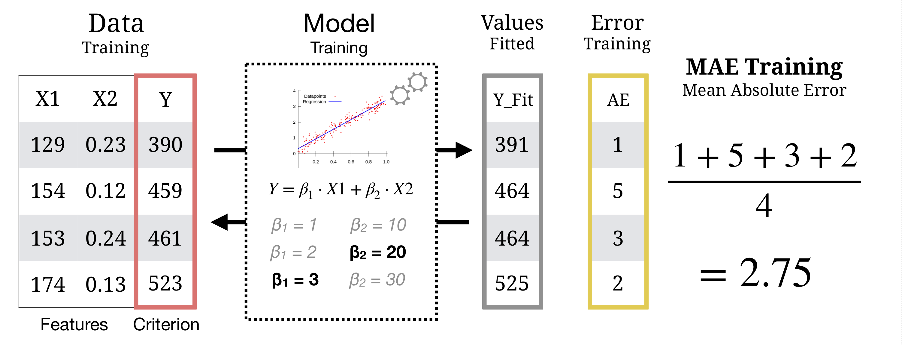

layout: true

<div class="my-footer"><span>
<a href="https://therbootcamp.github.io/"><font color="#7E7E7E">Applied Machine Learning with R, January 2019</font></a>
&emsp;&emsp;&emsp;&emsp;&emsp;&emsp;&emsp;&emsp;&emsp;&emsp;&emsp;&emsp;&emsp;&emsp;&emsp;&emsp;&emsp;&emsp;&emsp;&emsp;
<a href="https://therbootcamp.github.io/"><font color="#7E7E7E">www.therbootcamp.com</font></a>
</span></div> 

---


```{r setup, include=FALSE}
options(htmltools.dir.version = FALSE)
# see: https://github.com/yihui/xaringan
# install.packages("xaringan")
# see: 
# https://github.com/yihui/xaringan/wiki
# https://github.com/gnab/remark/wiki/Markdown
options(width=110)
options(digits = 4)

# Get color palette functions

source("https://raw.githubusercontent.com/therbootcamp/therbootcamp.github.io/master/_materials/code/baselrbootcamp_palettes.R")
```

```{r, echo = FALSE ,message = FALSE, warning = FALSE}
knitr::opts_chunk$set(comment=NA, fig.width=6, fig.height=6, echo = TRUE, eval = TRUE, 
                      message = FALSE, warning = FALSE, fig.align = 'center', dpi = 200)
library(tidyverse)
library(ggthemes)
library(ggpubr)
library(caret)
library(ISLR)

baselers <- read_csv("https://raw.githubusercontent.com/therbootcamp/appliedML_2019Jan/master/1_Data/baselers.csv")


```

# Where we are at

.pull-left4[

- Have a business <high>question</high>:  How can I predict loan default?

- Have <high>data</high> relevant to that question: Records from 300 historical customers.

- Data is cleaned and in a <high>tidy</high>, rectangular format: Database, .csv.

<br>
### What's next?

<high>Select</high> and <high>train</high> model(s) depending on the <high>type of task</high>

]

.pull-right55[
<br2>
```{r, echo = FALSE, fig.align = 'center', out.width = "100%", fig.cap = "Source: Medium.com"}
knitr::include_graphics("https://cdn-images-1.medium.com/max/1600/1*_QGyIwpgq831xI54cIe_GQ.jpeg")
```

]


---

# What type of task do you have?

.pull-left45[

There are <high>many types of of ML tasks</high>.

In this course, we will focus on 2 of the most popular

<br>

|Type|Description | Example |
|:----|:---- |:----|
|<high>Regression</high> (supervised)|Predicting a number|Stock prices|
|<high>Classification</high> (supervised)|Predicting a category, like whether|Whether someone will purchase a product or not|

]

.pull-right5[

```{r, echo = FALSE, fig.align = 'center', out.width = "100%"}
knitr::include_graphics("https://github.com/therbootcamp/appliedML_2019Jan/blob/master/_sessions/Fitting/image/class_v_regression.jpg?raw=true")
```

]

---

.pull-left45[

# What ML models are there?

<br>
There are *thousands* of machine learning models

In this course, you will learn 3 of the most popular:

|Model|Description|
|:----|:---- |
|<high>Regression</high>|A weighted linear combination of features and weights|
|<high>Decision Tree</high>|A series of hierarchical 'yes/no' decisions|
|<high>Random Forests</high>|Combination of many decision trees|


]

.pull-right5[
<br><br2>
```{r, echo = FALSE, fig.align = 'center', out.width = "90%"}
knitr::include_graphics("https://github.com/therbootcamp/appliedML_2019Jan/blob/master/_sessions/Fitting/image/three_models_vert.jpg?raw=true")
```

]

---
class: center, middle

## Once you have a model you need to "Fit" (aka, "Train") it to data.

<font size=5><high>What does that mean?</high></font>

<br>

```{r, echo = FALSE, out.width = "50%", fig.cap = "<font size = 3>James et al., Introduction to SL</font>"}
knitr::include_graphics("https://afit-r.github.io/public/images/analytics/regression/sq.errors-1.png")
```


---

# What does "Fitting" mean?

.pull-left5[

For any model class, there is no "One" single model.

> How many possible Regression models are there?

<br2>
Any machine learning model can be 'fit' (aka 'trained') on a specific dataset of interest. This means <high>finding the "best" version of a model</high> for a specific dataset.

> "Let me represent the data in the best way I can given how I work"<br>
>~ Model during fitting

<br2>
The "best" model is usually defined as a combination of <high>accuracy</high> (higher better!) and <high>complexity</high> (simpler is better!)

]

.pull-right45[

```{r, echo = FALSE}
set.seed(101)
x <- rnorm(20)
y <- .7 * x + rnorm(20) + 10

data <- data.frame(x, y)

mod <- lm(y ~ x, data = data)

library(tidyverse)

three_mod <- ggplot(data, aes(x = x, y = y)) + geom_point() +
    theme_minimal() +
    scale_color_baselrbootcamp()

  # geom_abline(slope = 2, intercept = 8, col = "blue", size = 1) +
  # geom_abline(slope = .2, intercept = 11, col = "red", size = 1) +
  # geom_abline(slope = mod$coefficients[2], intercept = mod$coefficients[1], col = "green", size = 1) +

```

<p align="center"><font size=5><high>How do I fit a model to these data?</font></high></p>

```{r, echo = FALSE, fig.width = 3, fig.height = 3, dpi = 200, out.width = "80%"}
three_mod
```


]


```{r, echo = FALSE}
set.seed(102)
x <- rnorm(10)
y <- .7 * x + rnorm(10, sd = .3) + 2

data <- data.frame(x, y)

mod <- lm(y ~ x, data = data)

great_intercept <- mod$coefficients[1]
great_slope <- mod$coefficients[2]

bad_intercept <- 3.5
bad_slope <- -.5

x0 = x
x1 = x
y0 = y
y1 = great_intercept + great_slope * x

dat_great <- data.frame(x0, x1, y0, y1)

x0 = x
x1 = x
y0 = y
y1 = bad_intercept + bad_slope * x

dat_bad <- data.frame(x0, x1, y0, y1)

library(tidyverse)

raw <- ggplot(dat_great, aes(x = x0, y = y0)) + geom_point(col = baselrbootcamp_cols("grey"), size = 2) +
  theme_minimal() +
  xlim(c(-2, 3)) +
  ylim(c(0, 5)) +
  labs(title = "Raw Data", 
       x = "Feature", y = "Criterion")

great_raw <- ggplot(dat_great, aes(x = x0, y = y0)) + geom_point(col = baselrbootcamp_cols("grey"), size = 2) +
  geom_abline(slope = great_slope, intercept = great_intercept, size = .5, linetype = 3) +
  theme_minimal() +
  xlim(c(-2, 3)) +
  ylim(c(0, 5)) +
  labs(title = "Model B", 
              subtitle = paste0("B0 = ", round(great_intercept, 2), ", B1 = ", round(great_slope, 2)),
       caption = paste("Mean Squared Error (MSE) = ?"),

       x = "Feature", y = "Criterion")

bad_raw <- ggplot(dat_bad, aes(x = x0, y = y0)) + geom_point(col = baselrbootcamp_cols("grey")) +
  geom_abline(slope = bad_slope, intercept = bad_intercept, size = .5, linetype = 3) +
  theme_minimal() +
  xlim(c(-2, 3)) +
  ylim(c(0, 5)) +
   labs(title = "Model A", 
        subtitle = paste0("B0 = ", round(bad_intercept, 2), ", B1 = ", round(bad_slope, 2)),
       caption = paste("Mean Squared Error (MSE) = ?"),
       x = "Feature", y = "Criterion")

great_err <- great_raw + 
  geom_linerange(data = dat_great, aes(x = x0, ymin = y0, ymax = y1), col = baselrbootcamp_cols("magenta")) +
  geom_point(data = dat_great, aes(x = x0, y = y1, size = 2), col = baselrbootcamp_cols("green"), pch = "X", size = 4) +
    labs(title = "Model B - Better", 
       caption = paste("Mean Squared Error (MSE) = ", round(mean((dat_great$y1 - dat_great$y0) ^ 2), 2)),
       x = "Feature", y = "Criterion")

bad_err <- bad_raw +
    geom_linerange(data = dat_bad, aes(x = x0, ymin = y0, ymax = y1), col = baselrbootcamp_cols("magenta")) +
    geom_point(data = dat_bad, aes(x = x0, y = y1, size = 2), col = baselrbootcamp_cols("green"), pch = "X", size = 4) +
   labs(title = "Model A - Worse", 
       caption = paste("Mean Squared Error (MSE) = ", round(mean((dat_bad$y1 - dat_bad$y0) ^ 2), 2)),
       x = "Feature", y = "Criterion")
```


---

# Defining Accuracy (or Error)


.pull-left45[

To train (fit) a model to a dataset, we need to <high>mathematically define Accuracy</high>

Alternatively, we can define a model's <high>Error</high>

There is <high>no 'correct'</high> definition of error, it depends on <high>what's important to you</high> as the decision maker!

Once accuracy (or error) is defined, a model can be trained to maximize (or minimize) it!

The model that minimizes error (or maximizes accuracy) is the final <high>Training model</high>

]

.pull-right45[

<p align="center"><font size=5><high>How do I fit a model to these data?</font></high></p>

```{r, echo = FALSE, fig.width = 3, fig.height = 3, dpi = 200, out.width = "80%"}
three_mod
```
]

---

# Which of these models is better? Why?

```{r, echo = FALSE, fig.width = 6, fig.height = 3, dpi = 200, out.width = "90%"}
ggarrange(bad_raw, great_raw, ncol = 2, nrow = 1)
```


---

# Which of these models is better? Why?

```{r, echo = FALSE, fig.width = 6, fig.height = 3, dpi = 200, out.width = "90%"}
ggarrange(bad_err, great_err, ncol = 2, nrow = 1)
```


---

# Regression Error

.pull-left45[

#### MAE: Mean Absolute Error

$$\large MSE = \frac{1}{n}\sum_{i=1}^{n} \lvert Prediction_{i} - Truth_{i} \rvert$$

> On average, how far are predictions away from true values?


#### MSE: Mean Squared Error

$$\large MSE = \frac{1}{n}\sum_{i=1}^{n}(Prediction_{i} - Truth_{i})^{2}$$
> On average, how far are predictions away from true values (squared!)?


]

.pull-right5[

```{r, fig.width = 3, fig.height = 2.5, echo = FALSE}
bad_err +
  labs(subtitle = "Red lines are (absolute) errors", title = NULL)
```

]


---

.pull-left45[

# Classification Accuracy

Classification accuracy measures all come from the <high> "confusion matrix"</high>

The confusion matrix is a cross tabulation table showing predictions versus true classes.

#### Confusion Matrix

|    |      Y is Positive      | Y is Negative |
|--------------|:-------------:|:------:|
| Predict <br>"Positive"| <font color = "#6ABA9A">TP<br> True Positive</font>| <font color = "#EA4B68">FP <br> False Positive</font> |
| Predict <br>"Negative"|    <font color = "#EA4B68">FN<br> False Negative</font>   |  <font color = "#6ABA9A">TN <br> True Negative</font>|

<i>Note: Green cells are <font color = "#6ABA9A">correct decisions</font> while Red cells are <font color = "#EA4B68">incorrect decisions</font></i>


]

.pull-right5[

<br>

#### Data

||X1|X2|X3|Prediction|Truth|Outcome|
|:---|:----|:----|:----|:----|:----|:----|
|1|.|.|.|"Default"|Default|<font color = "#6ABA9A">TP</font>|
|2|.|.|.|"Default"|Default|<font color = "#6ABA9A">TP</font>|
|3|.|.|.|"Repay"|Repay|<font color = "#6ABA9A">TN</font>|
|4|.|.|.|"Default"|Repay|<font color = "#EA4B68">FP</font>|
|5|.|.|.|"Repay"|Default|<font color = "#EA4B68">FN</font>|
|6|.|.|.|"Default"|Default|<font color = "#6ABA9A">TP</font>|
|7|.|.|.|"Repay"|Repay|<font color = "#6ABA9A">TN</font>|

#### Confusion Matrix

|                  |      True Default      | True Repay  |
|------------------|:-------------:|:------:|
| "Default"| <font color = "#6ABA9A">3</font>| <font color = "#EA4B68">1 </font> |
| "Repay"|    <font color = "#EA4B68">1</font>   |  <font color = "#6ABA9A"> 2</font>|

]

---

.pull-left45[

# Classification Accuracy

Classification accuracy measures all come from the <high> "confusion matrix"</high>

The confusion matrix is a cross tabulation table showing predictions versus true classes.

#### Confusion Matrix

|                       |      Y is Positive      | Y is Negative |
|-----------------------|:-------------:|:------:|
| Predict <br>"Positive"| <font color = "#6ABA9A">TP<br> True Positive</font>| <font color = "#EA4B68">FP <br> False Positive</font> |
| Predict <br>"Negative"|    <font color = "#EA4B68">FN<br> False Negative</font>   |  <font color = "#6ABA9A">TN <br> True Negative</font>|

<i>Note: Green cells are <font color = "#6ABA9A">correct decisions</font> while Red cells are <font color = "#EA4B68">incorrect decisions</font></i>


]

.pull-right5[

<br>
#### Overall Accuracy

> What percent of my predictions are correct?

$$\large Overall \; Accuracy = \frac{TP + TN}{ TP + TN + FN + FP}$$

#### Sensitivity

> <i>Of the truly Positive cases</i>, what percent of predictions are correct?


$$\large Sensitivity = \frac{TP}{ TP +FN }$$
#### Specificity

> <i>Of the truly Negative cases</i>, what percent of predictions are correct?

$$\large Specificity = \frac{TN}{ TN + FP }$$


]


---

.pull-left45[

# Classification Accuracy

### Example: Loan default

Imagine we use a model (e.g. a decision tree) to predict whether or not each of 7 customers will default on their loan.

After the loan period is over, we obtain the final confusion matrix comparing our predictions to the truth:

### Confusion Matrix

|                     |      True Default      | True Repay  |
|---------------------|:-------------:|:------:|
| Predict <br>"Default"| <font color = "#6ABA9A">TP <br>3</font>| <font color = "#EA4B68">FP <br>1 </font> |
| Predict <br>"Repay"|    <font color = "#EA4B68">FN<br>1</font>   |  <font color = "#6ABA9A">TN <br> 2</font>|

]

.pull-right5[

<br>

#### Overall Accuracy

Across all customers, our model has an accuracy of 71%

$$\large Overall \; Accuracy = \frac{3 + 2}{3 + 2 + 1 + 1} = 0.71$$

#### Sensitivity

Our model is 75% accurate in catching true defaults

$$\large Sensitivity = \frac{3}{3 + 4} = .75$$
#### Specificity

Our model is 67% accurate in catching true repayments


$$\large Specificity = \frac{2}{ 2 + 1 }= 0.67$$


]


---

.pull-left45[

# Ready to fit!

Now we're ready to fit models to data!

In this course will cover three commonly used models, <high>Regression</high>, <high>Decision Trees</high>, and <high>Random Forest</high>.

These models can be used in both regression and classification tasks.

As you'll see, they differ in complexity in important regards.

|Model|Complexity|
|:----|:---- |
|Regression|<font color = "#EACC48">Medium</font>|
|Decision Tree|<font color = "#6ABA9A">Low</font> (usually)|
|Random Forests|<font color = "#EA4B68">High</font>|

]

.pull-right5[
<br>
```{r, echo = FALSE, fig.align = 'center', out.width = "90%"}
knitr::include_graphics("https://github.com/therbootcamp/appliedML_2019Jan/blob/master/_sessions/Fitting/image/three_models_vert.jpg?raw=true")
```

]


---

# Model Training (aka fitting)

```{r, echo = FALSE}

```

---
class: center, middle

<high><h1>Regression</h1></high>

<font color = "gray"><h1>Decision Trees</h1></font>

<font color = "gray"><h1>Random Forests</h1></font>


---

# Regression

.pull-left4[

In [regression](https://en.wikipedia.org/wiki/Regression_analysis), the criterion Y is modeled as the <high>sum</high> of <high>predictors times weights</high> $\beta_{1}$, $\beta_{2}$</high>.

$$\hat{Y} =  \beta_{0} + X1 \times \beta_{X1} + X2 \times \beta_{X2} + ...$$
<br>

```{r, echo = FALSE, out.width = "100%", fig.cap = "<font size = 3>James et al., Introduction to SL</font>"}
knitr::include_graphics("https://afit-r.github.io/public/images/analytics/regression/sq.errors-1.png")
```

]

.pull-right55[

#### Interpretation

$$\LARGE \hat{Y} =  \beta_{0} + X1 \times \beta_{X1} + X2 \times \beta_{X2} + ...$$

Each beta weight $\beta_{i}$ can be interpreted as:

<q>As the value of $X_{i}$ increases by 1, how does the criterion $Y$ change?</q>

The more extreme $\beta_{i}$ is (either positive or negative), the more $X_{i}$ is used to predict the criterion $Y$ (Note: take into account the scale of $X_{i}$!).

If a value of $\beta_{i}$ is exactly 0, that means $X_{i}$ does not help us predict the criterion $Y$


]

---

# Regression

.pull-left4[

In [regression](https://en.wikipedia.org/wiki/Regression_analysis), the criterion Y is modeled as the <high>sum</high> of <high>predictors times weights</high> $\beta_{1}$, $\beta_{2}$</high>.

$$\hat{Y} =  \beta_{0} + X1 \times \beta_{X1} + X2 \times \beta_{X2} + ...$$
<br>

```{r, echo = FALSE, out.width = "100%", fig.cap = "<font size = 3>James et al., Introduction to SL</font>"}
knitr::include_graphics("https://afit-r.github.io/public/images/analytics/regression/sq.errors-1.png")
```

]

.pull-right55[

### Sales Example

```{r, echo = FALSE, out.width = "100%"}
knitr::include_graphics("image/Carseats_ss.jpg")
```


<u>Regression Model</u>

$$\large Sales =  \beta_{0} + CompPrice \times \beta_{CompPrice} + Income \times \beta_{Income} + ...$$
<u>Estimates</u>

$$\large Sales =  10 + CompPrice \times 5.4 + Income \times  1.3 + ...$$

]


---
class: center,  middle

<br><br>

# Let's fit regression models with caret!

```{r, echo = FALSE, out.width = "70%"}
knitr::include_graphics("https://3qeqpr26caki16dnhd19sv6by6v-wpengine.netdna-ssl.com/wp-content/uploads/2014/09/Caret-package-in-R.png")
```


```{r, echo = FALSE}
library(caret)
data(cars)
```


---


.pull-left4[

# `caret`

<u>Main caret fitting functions</u>

| Function| Purpose|
|--------|----------|
| [trainControl()](http://topepo.github.io/caret/model-training-and-tuning.html#basic-parameter-tuning) | Determine how training (in general) will be done|
| [train()](http://topepo.github.io/caret/model-training-and-tuning.html#model-training-and-parameter-tuning) | Specify a model and find *best* parameters|
| predict() | Predict values (either fitted values or predictions for new data)|
| [postResample()](http://topepo.github.io/caret/measuring-performance.html) | Evaluate model performance (fitting or prediction)|

]

.pull-right5[

<br>

```{r, eval = FALSE}
# Step 1: Load data
#   read_csv()

data_train <- read_csv(...)

# Step 2: Define control parameters
#   trainControl()

ctrl <- trainControl(...) 

# Step 3: Train and explore model
#   train()

mod <- train(...)
summary(mod)
mod$finalModel   # see final model

# Step 4: Assess fit
#   predict(), postResample()

fit <- predict()
postResample(fit, truth)

# Step 5: Visualise results

ggplot(...)
```


<!-- Caret documentation: [http://topepo.github.io/caret/](http://topepo.github.io/caret/) -->

<!-- <iframe src="http://topepo.github.io/caret/" height="480px" width = "500px"></iframe> -->

]

---

# `trainControl()`

.pull-left55[

Use `trainControl()` to define how `caret` should, generally, <high>select the best parameters</high> for an ML model.

Here you can tell `caret` to do things like repeated <high>cross validation</high> (which we will learn about later).

|Argument|Description|
|:-----|:----|
|`method`|How should fitting be done?|

For now, we'll set `method = "none"` to keep things simple to <high>fit the model without advanced parameter tuning</high>.

```{r}
# Fit the model without any 
#  advanced parameter tuning methods

ctrl <- trainControl(method = "none")
```

]

.pull-right4[

```{r, eval = F}
?trainControl
```

```{r, echo = FALSE, out.width = "100%"}
knitr::include_graphics("image/traincontrol_help.jpg")
```

]

---

# `train()`

.pull-left4[

`train()` is the workhorse fitting function of `caret`.

With just this one function, you can <high>fit any of 200+ models</high> just by changing the <high>method</high> argument!


|Argument|Description|
|:-----|:----|
|`form`|Formula specifying criterion|
|`data`|Training data|
|`method`| Model|
|`trControl`| Control parameters|

]


.pull-right55[

#### Train a Regression model

Regression: `method = "glm"`

```{r, echo = TRUE, out.width = "90%", eval = TRUE, warning = FALSE}
# Fit a regression model predicting Price

mod <- train(form = income ~ ., # Formula
             data = baselers,   # Training data
             method = "glm",    # Regression
             trControl = ctrl)  # Control Parameters
```


]


---

# `train()`

.pull-left4[

`train()` is the workhorse fitting function of `caret`.

With just this one function, you can <high>fit any of 200+ models</high> just by changing the <high>method</high> argument!

|Argument|Description|
|:-----|:----|
|`form`|Formula specifying criterion|
|`data`|Training data|
|`method`| Model|
|`trControl`| Control parameters|
]


.pull-right55[

#### Train a Random Forest model

Random Forest: `method = "rf"`

```{r, echo = TRUE, out.width = "90%", eval = TRUE, warning = FALSE}
# Fit a Random Forest model predicting Price

mod <- train(form = income ~ ., # Formula
             data = baselers,   # Training data
             method = "rf",     # Random Forests
             trControl = ctrl)  # Control Parameters
```

]


---

.pull-left4[

# `train()`

`train()` is the workhorse fitting function of `caret`.

With just this one function, you can <high>fit any of 200+ models</high> just by changing the <high>method</high> argument!

Find all 280+ models [here](http://topepo.github.io/caret/available-models.html).

]


.pull-right55[

<br>
```{r, echo = FALSE, out.width = "80%"}

```


]

---
.pull-left4[

# `train()`

Make sure your criterion is the correct class for your type of modelling task

- Numeric criterion = Regression Task
- Factor criterion = Classification Task

```{r, eval = FALSE}
# My training data
Loans
```

```{r, echo = FALSE}
Loans <- tibble::tibble(Default = c(0, 1, 0, 1, 1),
              Age = c(45, 36, 76, 25, 36),
             Gender = c("M", "F", "F", "M", "F"),
             Cards = c(3, 2, 5, 2, 3),
             Education = c(11, 14, 12, 17, 12)
             )

Loans
```

See that the column Default is 0's and 1's, but is coded as numeric.

]

.pull-right55[

<br><br><br><br>

This code will think that Default is a continuous number, not a category (probably not what you want)

```{r, eval = FALSE}
# Will be a regression task if Default is numeric

mod <- train(form = default ~ .,
             data = Loans,
             method = "glm",
             trControl = ctrl)
```

<font color='red' size = 3>Warning messages:...Are you sure you wanted to do regression?</font>

Use `factor()` to <high>convert your criterion</high> to a factor, now you are doing classification!

```{r, eval = FALSE}
# Will be a classification task

mod <- train(form = factor(Default) ~ .,
             data = Loans,
             method = "glm")
```

]


---
.pull-left35[

# .$finalModel

The `train()` function returns a list with a key object called `finalModel` - this is your final machine learning model!

You can access the model with `mod$finalModel`, and explore the object with generic functions:


|Function|Description
|:------|:----|
|`summary()`| Overview of the most important information|
|`names()`|See all named elements you can access with $|

]

.pull-right6[

<br>
```{r, eval = FALSE, echo = TRUE}
# Create a regression object
mod <- train(form = income ~ age + height + fitness,
             data = baselers)   # Training data

# Look at final model
mod$finalModel
# [...]
```

```{r, eval = TRUE, echo = FALSE}
mod <- train(form = income ~ age + height + fitness,  # Formula
             data = baselers,       # Training data
             method = "glm",    # Regression
             trControl = ctrl)  # Control Parameters
```


```{r}
# Look at all named outputs
names(mod$finalModel)

# Access specific outputs
mod$finalModel$coefficients
```


]


---

# `predict()`

.pull-left5[

The `predict()` function is allows you to return predictions from a model.

Put your model object as the first argument. If you don't specify a new dataset with `newdata`, the function returns <high>fitted values from training</high>


```{r}
# Get fitted values
glm_fits <- predict(object = mod)
```

The result is a vector

```{r}
# Result is a vector of fits
glm_fits[1:5]
```

]

.pull-right45[

#### Plot of fits versus Truth

If the model was perfect, all points would be on diagonal


```{r, fig.width = 4, fig.height = 3, fig.align = 'center', echo = FALSE}
# Plot fits versus truth
tibble(fits = glm_fits[1:100],
       truth = baselers$income[1:100]) %>%
ggplot(aes(x = fits, y = truth)) + 
  geom_abline(slope = 1, intercept = 0) +
  geom_point(alpha = .1) +
  theme_bw()
```


]

---

# `postResample()`

.pull-left5[

To calculate aggregate model performance, use `postResample()`

|Argument|Description|
|:----|:----|
|pred|Model predictions (or fits)|
|obs|The observed (true) values|

<br>

```{r}
# Assess performance with postResample()

postResample(pred = glm_fits, # Predictions 
             obs = baselers$income) # Truth
```

```{r, echo = FALSE, eval = TRUE}
x <- postResample(pred = glm_fits, 
                 obs = baselers$income)
```

]

.pull-right45[

#### Plot of fits versus Truth

Red lines indicate absolute error(s)


```{r, fig.width = 4, fig.height = 3, fig.align = 'center', echo = FALSE}
tibble(fits = glm_fits[1:100],
       truth = baselers$income[1:100]) %>%
ggplot(aes(x = fits, y = truth)) + 
    geom_point(alpha = .2) +
geom_linerange(aes(x = fits, ymin = fits, ymax = truth), col = baselrbootcamp_cols("magenta")) +
  geom_abline(slope = 1, intercept = 0) +
  theme_bw()
```

]

---

class: middle, center

<h1> Questions?</h1>

<h1><a href=https://therbootcamp.github.io/appliedML_2019Jan/_sessions/Fitting/Fitting_practical.html>Practical</a></h1>


