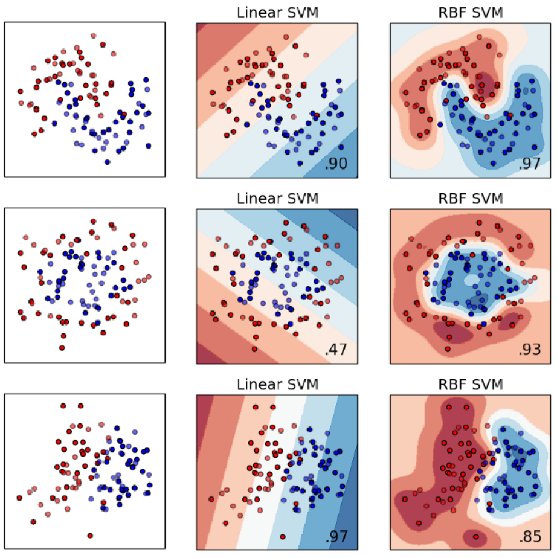
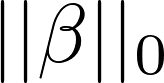

layout: true

<div class="my-footer"><span>
<a href="https://therbootcamp.github.io/"><font color="#7E7E7E">Applied Machine Learning with R, January 2019</font></a>
&emsp;&emsp;&emsp;&emsp;&emsp;&emsp;&emsp;&emsp;&emsp;&emsp;&emsp;&emsp;&emsp;&emsp;&emsp;&emsp;&emsp;&emsp;&emsp;&emsp;
<a href="https://therbootcamp.github.io/"><font color="#7E7E7E">www.therbootcamp.com</font></a>
</span></div> 

---

```{r, eval = TRUE, echo = FALSE, warning=F,message=F}
# Code to knit slides
#baselers <- readr::read_csv("../_data/baselers.csv")
```


```{r setup, include=FALSE}
options(htmltools.dir.version = FALSE)
# see: https://github.com/yihui/xaringan
# install.packages("xaringan")
# see: 
# https://github.com/yihui/xaringan/wiki
# https://github.com/gnab/remark/wiki/Markdown
options(width=110)
options(digits = 4)
```

```{r, echo = FALSE ,message = FALSE, warning = FALSE}
knitr::opts_chunk$set(comment=NA, fig.width=6, fig.height=6, echo = TRUE, eval = TRUE, 
                      message = FALSE, warning = FALSE, fig.align = 'center', dpi = 200)
library(tidyverse)
library(baselers)
library(ggthemes)

source("https://raw.githubusercontent.com/therbootcamp/therbootcamp.github.io/master/_materials/code/baselrbootcamp_palettes.R")
```


# There is no free lunch

.pull-left35[

<u>Theorem</u>

Given a finite set $V$ and a finite set $S$ of real numbers, <high>assume that $f:V\to S$ is chosen at random</high> according to uniform distribution on the set $S^{V}$ of all possible functions from $V$ to $S$. For the problem of optimizing $f$ over the set $V$, <high>then no algorithm performs better than blind search.</high>
<br><br><br><br>
<a href="https://ti.arc.nasa.gov/m/profile/dhw/papers/78.pdf">Wolpert & Macready, 1997, No Free Lunch Theorems for Optimization</a>

]

.pull-right55[

<p align="left">
  <br>
  
</p>

]

---

.pull-left4[

# Know your problem

<u>Bias-variance trade-off</u>

<font size=5><high>Error</high> = <high>Bias</high> + <high>Variance</high></font>

<br>
Simply put...

<high>Bias</high> arises from strong <high>model assumptions</high> not being met by the environment.

<high>Bias</high> arises from high <high>model flexibility</high> fitting the noise in the data (i.e., overfitting).

<br><br>
&#8594; <high>Make strong assumptions</high> (use simple models), if possible.

]

.pull-right45[

<p align="left">
  <br>
  
</p>

]


---

.pull-left4[
# Linear or non-linear
<br>

One important model assumptions concerns linearity.
<br><br>
<high>Linear models</high> (`lm`, `glm`) make strong model assumptions. They are more often wrong, but also ceteris paribus <high>less prone to overfitting</high>.

<high>Non-linear moels</high> (everything else) make weaker model assumptions, leaving the exact relationship (more) open. They are are closer to the truth, but also ceteris paribus <high>more prone to overfitting</high>. 


]

.pull-right5[

<p align="center">
  <br><br><br>
  
</p>

]

---

.pull-left45[

# Kernel trick

<high>Transforms "input space" into new "feature space"</high> to allows for object separation.

<p align="center">
  
</p>

Used in <high>Support Vector Machines</high> (e.g., `method = "svmRadial"`) often using a <high>radial basis function</high> (rdf).

<p align="center">
  
</p>

Kernels <high>re-represent objects</high> in terms of other objects!

]


.pull-right5[

<p align="center">
  <br><br><br>
  
</p>

]

---

# Automatic feature engineering

<high>Deep learning</high> aka neural networks and, espectially, <high>convolutional neural networks</high>, excel because they generate their features. 

Neural networks are not the focus of `caret` and this course. Powerful implementations based on <high>Google's Tensorflow</high> libarary are provided by `tensorflow`.


.pull-left3[

<p align="center">
  <br>
  
</p>


]

.pull-right65[

<p align="center">
  
</p>


]


---

# Robustness

.pull-left4[

To produce <high>robust predictions</high> that <high> suffer less from variance</high> ML models use a variety of <high>tricks</high>.

<p align="center">
  <br><br>
  
</p>

]


.pull-right55[
<table style="cellspacing:0; cellpadding:0; border:none;">
  <col width="210">
  <col width="210">
  <col width="210">
<tr>
  <th>Approach</th>
  <th>Implementation</th>
  <th>Examples</th>
</tr>
<tr style="background-color:#ffffff">
  <td align="center"><high>Tolerance</high></td>
  <td align="center">Decrease error tolerance</td>
  <td align="center"><mono>svmRadial</mono></td>
</tr>
<tr style="background-color:#ffffff">
  <td align="center"><high>Regularization</high></td>
  <td align="center">Penalize for complexity</td>
  <td align="center"><mono>lasso</mono>, <mono>ridge</mono>, <mono>elasticnet</mono></td>
</tr>
<tr style="background-color:#ffffff">
  <td align="center"><high>Ensemble</high></td>
  <td align="center">Bagging</td>
  <td align="center"><mono>treebag</mono>, <mono>randomGLM</mono>, <mono>randomForest</mono></td>
</tr>
<tr style="background-color:#ffffff">
  <td align="center"><high>Ensemble</high></td>
  <td align="center">Boosting</td>
  <td align="center"><mono>adaboost</mono><mono>xgbTree</mono></td>
</tr>
<tr style="background-color:#ffffff">
  <td align="center"><high>Feature selection</high></td>
  <td align="center">Regularization</td>
  <td align="center"><mono>lasso</mono></td>
</tr>
<tr style="background-color:#ffffff">
  <td align="center"><high>Feature selection</high></td>
  <td align="center">Importance</td>
  <td align="center"><mono>random forest</mono></td>
</tr>
</table>

]


---

# Regularization

.pull-left45[

Regularization is the process of adding model terms, usually <high>penalties for complexity</high>, in order to prevent overfitting (or solve a problem in the first place).

<br2>
<p align = 'center'><font size=5><high>Loss</high> = <high>Misfit</high> + <high>Penalty</high></font></p>
<br>

<table style="cellspacing:0; cellpadding:0; border:none;">
  <col width="160">
  <col width="160">
  <col width="160">
<tr>
  <th>Name</th>
  <th>Penalty</th>
  <th>`caret`</th>
</tr>
<tr style="background-color:#ffffff">
  <td align="center"><high>AIC/BIC</high></td>
  <td align="center"></td>
  <td align="center">-</td>
</tr>
<tr style="background-color:#ffffff">
  <td align="center"><high>Lasso</high></td>
  <td align="center"></td>
  <td align="center">`method = "lasso"`</td>
</tr>
<tr style="background-color:#ffffff">
  <td align="center"><high>Ridge</high></td>
  <td align="center"></td>
  <td align="center">`method = "ridge"`</td>
</tr>
<tr style="background-color:#ffffff">
  <td align="center"><high>Elastic Net</high></td>
  <td align="center"></td>
  <td align="center">`method = "elasticnet"`</td>
</tr>
</table>

]


.pull-right5[

```{r, fig.width = 6, fig.height = 5, echo = FALSE, eval = TRUE, warning = FALSE}
set.seed(5)

N <- 40

iv <- rnorm(N, mean = 10, sd = 2)
truth <- iv 
noise <- rnorm(N, mean = 0, sd = 2)
obs <- truth + noise

data <- data.frame(iv, obs)


poly_pred <- map_dfc(.x = c(1, 19), .f = function(degree) {
  
  output <- data.frame(lm(obs ~ poly(iv, degree), data = data)$fitted.values)
  
  names(output) <- paste0("d", degree)
  
  return(output)

}) %>% mutate(id = 1:N,
              x = iv,
              obs = obs) %>%
  gather(Degree, pred, -id, -x, -obs) %>%
  mutate(`Fitting` = abs(pred - obs))


poly_pred <- poly_pred %>%
  mutate(Degree = case_when(Degree == "d1" ~ "Simple",
                            TRUE ~ "Complex"))


overfit_gg <- ggplot(poly_pred, aes(x = x, y = pred, col = Degree)) + 
  geom_line(size = 1.5) +
  geom_point(aes(x = x, y = obs), col = "black", pch = 21) +
  annotate("segment", x = 5, y = 5, xend = 15, yend = 15, col = "black", linetype = 4, size = 1) +
  xlim(5, 15) +
  ylim(5, 15) +
  labs(title = "Model overfitting",
       subtitle = "Dashed line is TRUE model") +
  theme_bw() +
    theme(legend.position="bottom") +
    scale_color_baselrbootcamp()
 
overfit_gg

```

]

---

.pull-left45[

# Bagging

<high>Aggregate predictions from multiple fits to resampled data.</high>

Especially beneficial for models that produce relatively instable solutions, e.g., regression trees. `rpart` &#8594; `treebag`.

Random forest adds sampling of features to reduce dependencies across trees.

<br>
<u>Algorithm</u>
1. <high>Resample</high> data (without replacement)
2. <high>Fit</high> model to resampled data
3. <high>Average</high> predictions

]

.pull-right45[

<p align="center">
  <br><br><br>
  
</p>

]

---

# Boosting

.pull-left4[

Iterative algorithm that adaptively increases the weight given to previously misclassified samples.

New versions of the classic `adaboost` algorithm, e.g., `xgbTree`, <high>belong to the best ML models out there</high>. 

<u>Algorithm</u>
1. Assign <high>equal weight</high> to samples
2. <high>Fit</high> simple model
3. <high>Increase weight of misfit samples</high> by model misfit for next iteration
5. <high>Average predictions weighted by model misfit</high> 

]


.pull-right5[

<p align="center">
  
  

</p>

]

---

# Automatic feature selection

.pull-left45[

Many models reduce complexity by automatically relying on a subset of good features. 

<u>Two examples</u>

<high>LASSO</high>

Regularization, in particular via `lasso`, frequently <high>estimates <mono>beta = 0</mono></high> and, thus, essentially deselects that feature. 

<high>Random forests</high>

As random forests select at any node the best of `mtry`-many randomly selected features, <high>unpredictive features may never come to action</high>. This is especially true for large `mtry`. 


]


.pull-right45[

<p align="center">
  
  
  
</p>

]

---

# Excursus: Unsupervised learning

.pull-left5[

Unsupervised learning aims to <high>identify structure in the absence of labels</high>, i.e., a criterian. 

There is <high>no ground truth</high>, rendering unsupervised learning problems essentially <high>impossible to "solve"</high>, i.e., you never quite know how good a solution is.

<u>Common questions</u>

Are there <high>groups of cases</high> (clusters), which case belongs to which group, and how many groups are there? &#8594; `k-means` or `hierarchical clustering`

Are there <high>groups of features</high>, which features belongs to which group, and how many groups are there? &#8594; `pca` or `svd`

]


.pull-right45[

<p align="center">
  
  
  
</p>

]


---

# Excurse: Unsupervised learning

.pull-left45[

`k-means`, `hierarchical-clustering`, and other <high>clustering algorithms</high> attempt to find distributed membership to $k$ groups (clusters) such that <high>groups are maximally homogenous</high>.

<u>k-means</u>

Assign cases to the closest centroids (high-dimensional means) while iteratively shifting them around to <high>minimize within-group variance versus between-group variance</high>. 

<u>hierarchical clustering</u>

Place every case in one group. <high>Join clusters according to a pre-specified distance function</high> until the desired number of $k$ clusters is reached.  

]

.pull-right5[

<p align="center">
  
  
  
</p>

]

---

# Unsupervised learning

pca & svd


.pull-right45[

<p align = "center">

</p>

]

---

# Remember

.pull-left45[

<i>"…some machine learning projects succeed and some fail. What makes the difference? Easily the most important factor is the features used."</i>

Pedro Domingos

<br><br>

<i>"The algorithms we used are very standard for Kagglers. […] We spent most of our efforts in feature engineering. [...] We were also very careful to discard features likely to expose us to the risk of over-fitting our model."</i>

Xavier Conort

]

.pull-right45[

<p align="center">
  
</p>

]


---


# Practical

class: middle, center

<h1><a href=https://therbootcamp.github.io/appliedML_2019Jan/_sessions/Models/Models_practical.html>Practical</a></h1>


