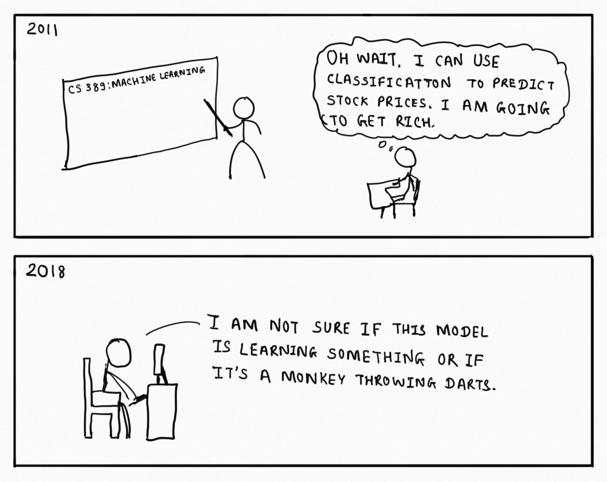

```{r setup, echo = FALSE}
knitr::opts_chunk$set(comment = NA, 
                      fig.width = 6, 
                      fig.height = 6,
                      fig.align = 'center',
                      echo = FALSE, 
                      eval = FALSE, 
                      warning = FALSE,
                      message = FALSE)

options(digits = 3)
```

```{r, echo = FALSE, fig.align = 'center', eval = TRUE, out.width = "60%", fig.cap=""}

```

## {.tabset}

### Overview

In this practical, you will enter two model competitions, one on regression and one on classification, to demonstrate your knwoledge of:

1. Machine learning models
2. Fitting and prediction
3. Cross-validation and optimization
4. Data preprocessing and feature selection

### Datasets

```{r, eval = TRUE, message = FALSE, echo = FALSE}
library(tidyverse)
library(ggthemes)
```

|File  |Rows | Columns |
|:----|:-----|:------|
|[murders_crime](https://raw.githubusercontent.com/therbootcamp/appliedML_2019Jan/master/1_Data/violent_crime.csv)| 1000 | 102|
|[nonviolent_crime](https://raw.githubusercontent.com/therbootcamp/appliedML_2019Jan/master/1_Data/nonviolent_crime.csv)| 1000 | 102|


```{r, message = FALSE, eval = TRUE, echo = FALSE}
# Load datasets locally
library(tidyverse)
pima_diabetes <- read_csv("https://raw.githubusercontent.com/therbootcamp/appliedML_2019Jan/master/1_Data/pima_diabetes.csv")
violent_crime <- read_csv("https://raw.githubusercontent.com/therbootcamp/appliedML_2019Jan/master/1_Data/violent_crime.csv")
nonviolent_crime <- read_csv("https://raw.githubusercontent.com/therbootcamp/appliedML_2019Jan/master/1_Data/nonviolent_crime.csv")
```

- The `murders_crime` and `violent_crime` data are subsets of the Communities and Crime Unnormalized Data Set data set from the UCI Machine Learning Repository. To see column descriptions, visit this site: [Communities and Crime Unnormalized Data Set](https://archive.ics.uci.edu/ml/datasets/Communities+and+Crime+Unnormalized)

### Cheatsheet

<figure>
<center>
<a href="https://github.com/rstudio/cheatsheets/raw/master/caret.pdf">
  
  <figcaption>hhttps://github.com/rstudio/cheatsheets/raw/master/caret.pdf</figcaption></a>
</figure>


# Mission statement

## A - Preliminaries

1. Open your `BaselRBootcamp` R project. It should already have the folders `1_Data` and `2_Code`. Make sure that the data file(s) listed in the `Datasets` section above are in your `1_Data` folder.

2. Open a new R script. At the top of the script, using comments, write your name and the date. Save it as a new file called `Models_practical.R` in the `2_Code` folder.  

3. Using `library()` load the set of packages for this practical listed in the packages section above.

```{r, eval = FALSE, echo = TRUE}
## NAME
## DATE
## Prediction Practical

library(tidyverse)
library(caret)
```

```{r, message = FALSE, warning = FALSE, echo = FALSE, eval = TRUE}
library(tidyverse)
```

4. In the code below, we will load each of the data sets listed in the `Datasets` as new objects.

```{r, echo = TRUE, eval = FALSE, message = FALSE, warning = FALSE}

# REGRESSION: (Non-) violent crime statistics
nonviolent_crime <- read_csv(file = "1_Data/nonviolent_crime.csv")

# CLASSIFICATION: Murders crime statistics
murders_crime <- read_csv(file = "1_Data/murders_crime.csv")
```

## B Competition rules

1. You may enter either one or both of two competitions, one on regression (`nonviolent_crime`) and on classification (`murders_crime`), for the price of &#127851;&#127851;&#127851;.

2. To enter the competitions, you must submit for each competition no more, no less than one caret `train`-object containing your candidate model. To submit the model, first save your model as an `.RDS`-file named `your_name_train.RDS` with `your_name` replaced by your name or pseudonym using the code below.

```{r}
# save trian obect as .RDS
saveRDS('1_Data/your_name_train.RDS')

```

3. Submit your `.RDS` file (containing your training object) via these following linkes sheets:

<div align = "center">
<table>
<tr>
  <td>Regression</td> 
  <td>non-violent crimes</td>
  <td>[**Submit candidate**](https://docs.google.com/forms/d/e/1FAIpQLSevxp_hxSUrAYgiSU-Xv3hRw_get43qk15blw7QEeLHlbrNbA/viewform?usp=sf_link)</td>
</tr>
<tr>
  <td>Classification</td> 
  <td>murders</td>
  <td>[**Submit candidate**](https://docs.google.com/forms/d/e/1FAIpQLSciw9WyTttmG9Oq93xjGKw_kxNJY9YmtLQvf_p35BcFNm1G-A/viewform?usp=sf_link)</td>
</tr>
</table>
</div>

4. You may work alone or team up with fellow participants. We recommend the latter, but working alone may, of course, mean more &#127851;&#127851;&#127851;.  

5. Use any trick in your bag (or `caret`'s bag). Feel free to try different models, use different tuning parameter settings, select any variables or variable selection methods that you deem useful.

6. You may even consider creating new variables. The code below shows you how to create new variables for either data set. Note, the created variables are not created based on any knowledge of the data - pure random selection. So if you want to come up with new variables, create your own. 

```{r eval = F, echo = T}
# (Non-) violent crime statistics
nonviolent_crime <- nonviolent_crime %>% 
  mutate(
    pctUrbanXindianPerCap2 = pctUrban * indianPerCap ** 2,
    FemalePctDiv^PctFam2Par = FemalePctDiv ** PctFam2Par)

# Murders crime statistics
murders_crime <- murders_crime %>% 
  mutate(
    AsianPerCapXHousVacant2 = AsianPerCap * HousVacant ** 2,
    population%blackPerCap = population / blackPerCap)
```


