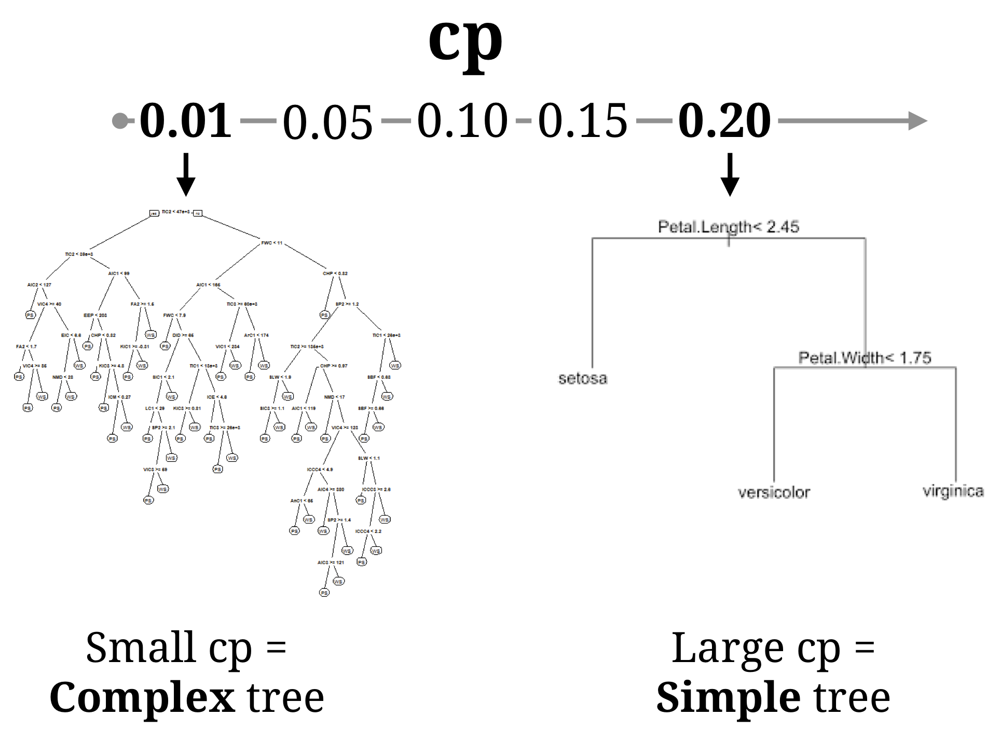

layout: true

<div class="my-footer"><span>
<a href="https://therbootcamp.github.io/"><font color="#7E7E7E">Applied Machine Learning with R, January 2019</font></a>
&emsp;&emsp;&emsp;&emsp;&emsp;&emsp;&emsp;&emsp;&emsp;&emsp;&emsp;&emsp;&emsp;&emsp;&emsp;&emsp;&emsp;&emsp;&emsp;&emsp;
<a href="https://therbootcamp.github.io/"><font color="#7E7E7E">www.therbootcamp.com</font></a>
</span></div> 

---

```{r, eval = TRUE, echo = FALSE, warning=F,message=F}
# Code to knit slides
baselers <- readr::read_csv("../../1_Data/baselers.csv")


source("https://raw.githubusercontent.com/therbootcamp/therbootcamp.github.io/master/_materials/code/baselrbootcamp_palettes.R")
```


```{r setup, include=FALSE}
options(htmltools.dir.version = FALSE)
# see: https://github.com/yihui/xaringan
# install.packages("xaringan")
# see: 
# https://github.com/yihui/xaringan/wiki
# https://github.com/gnab/remark/wiki/Markdown
options(width=110)
options(digits = 4)


```

```{r, echo = FALSE ,message = FALSE, warning = FALSE}
knitr::opts_chunk$set(comment=NA, fig.width=6, fig.height=6, echo = TRUE, eval = TRUE, 
                      message = FALSE, warning = FALSE, fig.align = 'center', dpi = 200)
library(tidyverse)
library(baselers)
library(ggthemes)
library(caret)

baselers <- read_csv("../../1_Data/baselers.csv")


set.seed(5)

N <- 40

iv <- rnorm(N, mean = 10, sd = 2)
truth <- iv 
noise <- rnorm(N, mean = 0, sd = 2)
obs <- truth + noise

data <- data.frame(iv, obs)


poly_pred <- map_dfc(.x = c(1, 19), .f = function(degree) {
  
  output <- data.frame(lm(obs ~ poly(iv, degree), data = data)$fitted.values)
  
  names(output) <- paste0("d", degree)
  
  return(output)

}) %>% mutate(id = 1:N,
              x = iv,
              obs = obs) %>%
  gather(Degree, pred, -id, -x, -obs) %>%
  mutate(`Training` = abs(pred - obs))


poly_pred <- poly_pred %>%
  mutate(Degree = case_when(Degree == "d1" ~ "Simple",
                            TRUE ~ "Complex"))


overfit_gg <- ggplot(poly_pred, aes(x = x, y = pred, col = Degree)) + 
  geom_line(size = 1.5) +
  geom_point(aes(x = x, y = obs), col = "black", pch = 21) +
  annotate("segment", x = 5, y = 5, xend = 15, yend = 15, col = "black", linetype = 4, size = 1) +
  xlim(5, 15) +
  ylim(5, 15) +
  labs(title = "Model overfitting",
       subtitle = "Dashed line is TRUE model") +
  theme_bw() +
    theme(legend.position="bottom") +
  scale_color_baselrbootcamp()
  
poly_pred <- poly_pred %>% mutate(

  obs_new = x + rnorm(1, mean = 0, sd = 2),
  `Testing` = abs(obs_new - pred)
  
)


poly_pred <- poly_pred %>%
  select(Degree, `Training`, `Testing`) %>%
  gather(phase, Error, -Degree)

agg <- poly_pred %>%
  group_by(Degree, phase) %>%
  summarise(Error = mean(Error)) %>%
  ungroup() %>%
  mutate(phase = factor(phase, levels = c("Training", "Testing"), ordered = TRUE))
 
fit_gg <- ggplot(agg, aes(x = phase, y = Error, fill = Degree)) +
  geom_bar(position = "dodge", stat = "identity") +
  labs(title = "Fitting versus Prediction Error",
       subtitle = "Smaller values are better!",
       x = "Modelling Phase") +  
  scale_y_continuous(limits=c(.75,1.25),oob = scales::rescale_none) +
  theme_bw() +
    theme(legend.position="bottom") +
  scale_fill_baselrbootcamp()

```


.pull-left4[
<br><br>
# Where we are

- <high>Train</high> one of several models (<high>regression</high>, <high>decision trees</high>, and <high>random forests</high>) on training data.

- Explore models - show regression coefficients, plot decision trees (etc)

- Assess model <high>prediction</high> performance on <high>test</high> data
    - Mean Absolute Error (MAE)

]

.pull-right55[

### Model Training

```{r, echo = FALSE}
knitr::include_graphics("image/model_training_flow.png")
```

### Model Testing

```{r, echo = FALSE}
knitr::include_graphics("image/model_testing_flow.png")
```

]

---


.pull-left4[
<br><br><br>
# Overfitting

When a model is consistently <high>less accurate in predicting future data</high> than in <high>fitting training data<high>, this is called <high>overfitting</high>

Just because model A is better than model B in training, does not mean it will be better in testing!

Extremely flexible models that tend to overfit are like 'wolves in sheep's clothing'

]


.pull-right55[


<br><br>
```{r, echo = FALSE,  fig.cap = "<font size = 4>victoriarollison.com (adapted)</font>", out.width = "100%"}
knitr::include_graphics("image/wolf_complex.png")
```

]

---

.pull-left4[
<br><br><br>

# Overfitting

### How will we try to avoid overfitting?

Use regression models with <high>regularization</high> terms, such as <high>ridge</high> and <high>lasso</high> which explicitly <high>punish model complexity</high>.

Use <high>cross-validation</high> to find <high>optimal tuning parameters</high>, including regularization.

]

.pull-right55[

### Regularized Regression

```{r, echo = FALSE, eval = TRUE, out.width = "100%", fig.cap = "L1 Lasso Penalty"}
knitr::include_graphics("image/lasso_penalty_eq.jpg")
```

### Cross Validation

```{r, echo = FALSE, eval = TRUE, out.width = "90%"}
knitr::include_graphics("image/crossvalidation_4fold.png")
```

]

---

.pull-left55[

# Tuning parameters (Recap)

### What are tuning parameters?

<high>Tuning parameters</high> are parameters that <high>guide</high> (aka. 'tune') a model during fitting.

- Decision trees: complexity tuning parameter <high>cp</high>
- Random forests diversity tuning parameter <high>mtry</high>
    
Tuning parameters do not show up in the final model (you never see a complexity parameter in a final decision tree)! They are only used to guide fitting.

There is not one 'best' tuning parameter, it always depends on your specific dataset.

]

.pull-right45[

```{r, echo = FALSE, eval = TRUE, out.width = "80%"}

```

```{r, echo = FALSE, eval = TRUE, out.width = "80%"}
knitr::include_graphics("image/mtry_parameter.png")
```

]


---

# Regularized Regression

There are two common methods to fit penalized (aka regularized) regression models: Ridge and Lasso. Each penalizes regression models for having large $\beta$ values using the <high>Lambda tuning parameter</high>

.pull-left5[

### Ridge

The Lasso penalty is known as the $\ell2$ norm, where Beta weights are selected by <high>minimizing</high> the following equation:

```{r, echo = FALSE, out.width = "100%"}

```

As $\lambda$ "Lambda" increases, coefficients are pushed towards (but not necessarily exactly to) 0.

]

.pull-right45[


```{r, echo = FALSE, out.width = "80%", fig.cap = "<font size = 4>James et al., ISLR</font>"}

```

]


---

# Regularized Regression

There are two common methods to fit penalized (aka regularized) regression models: Ridge and Lasso. Each penalizes regression models for having large $\beta$ values using the <high>Lambda tuning parameter</high>

.pull-left3[

### Ridge

To fit Ridge penalized regression in R, use `method = "glmnet`.

In the `tuneGrid` argument: 

- `alpha = 0` indicates the $\ell2$ Ridge penalty.
- `lambda` = Vector of lambda tuning parameters values to try.

]

.pull-right65[
<br>
```{r, eval = FALSE}
# Train ridge penalised regression model in R

train(form = criterion ~ .,
      data = data_train,
      method = "glmnet",
      trControl = ctrl,
      preProcess = c("center", "scale"),  # Standardise
      tuneGrid = expand.grid(alpha = 0, # Ridge penalty
                              lambda = 1:100)) # Lambda
```

]

---

# Regularized Regression

There are two common methods to fit penalized (aka regularized) regression models: Ridge and Lasso. Each penalizes regression models for having large $\beta$ values using the <high>Lambda tuning parameter</high>

.pull-left5[

### Lasso

The Lasso penalty is known as the $\ell1$ norm, where Beta weights are selected by minimizing the following equation:

```{r, echo = FALSE, out.width = "100%"}
knitr::include_graphics("image/lasso_penalty_eq.jpg")
```

As $\lambda$ increases, coefficients are pushed towards 0, with some being forced to <high>exactly 0</high>.

]

.pull-right45[

```{r, echo = FALSE, out.width = "80%", fig.cap = "<font size = 4>James et al., ISLR</font>"}

```

]

---

# Regularized Regression

There are two common methods to fit penalized (aka regularized) regression models: Ridge and Lasso. Each penalizes regression models for having large $\beta$ values using the <high>Lambda tuning parameter</high>

.pull-left3[

### Lasso

To fit Lasso penalized regression in R, use `method = "glmnet`.

In the `tuneGrid` argument: 

- `alpha = 1` indicates the $\ell1$ Lasso penalty
- `lambda` = Vector of lambda tuning parameters values to try.

]

.pull-right65[
<br>
```{r, eval = FALSE}
# Train Lasso penalised regression model in R

train(form = criterion ~ .,
      data = data_train,
      method = "glmnet",
      trControl = ctrl,
      preProcess = c("center", "scale"),  # Standardise
      tuneGrid = expand.grid(alpha = 1, # Lasso penalty
                              lambda = 1:100)) # Lambda
```

]


---

.pull-left45[

# K-Fold Cross-Validation

### What is it?

Cross-validation is a sampling procedure performed on training data used to <high>estimate a model's prediction performance</high> in future test data, and to determine <high>optimal tuning parameters</high> selected to minimize prediction error.

Cross-validation is not "cheating: because it is only performed on the training data (never on the true test dataset)

After cross-validation is complete, the model is trained on the entire dataset, using optimal tuning parameters, resulting in a <high>final model</high> which can be used for future model testing.

]

.pull-right5[
<br><br><br><br>

### Cross Validation

```{r, echo = FALSE, eval = TRUE}
knitr::include_graphics("image/crossvalidation_4fold.png")
```

]

---

.pull-left45[

# K-Fold Cross-Validation

### Steps

1) Split the original training data into K 'folds' (mutually exclusive groups of cases)

2) Select K - 1 folds for training, and 1 fold for testing.

3) Fit the model to the K - 1 training folds, and evaluate its testing accuracy on the test fold.

4) Repeat the process K times, so each fold is used once for testing.

5) Average the model's prediction error across all K folds

]

.pull-right5[
<br><br><br><br>

### Cross Validation

```{r, echo = FALSE, eval = TRUE}
knitr::include_graphics("image/crossvalidation_4fold.png")
```

]

---

.pull-left45[

# K-Fold Cross-Validation

### Determining optimal Tuning parameters

By trying different tuning parameters in each iteration, you can determine which value minimizes prediction error

Ex) Testing MAE values for values of `cp`

```{r, echo = FALSE, eval = FALSE}
df <- tibble("Fold" = c(1:4, "Mean"),
             "cp = .05" = c(5.13, 4.96, 5.34, 4.76, NA),
             "cp = .10" = c(4.76, 4.54, 4.96, 5.13, NA),
             "cp = .15" = c(4.24, 4.39, 4.13, 4.35, NA),
             "cp = .20" = c(5.38, 5.72, 6.17, 5.20, NA)
             )

df[5,2:5] <- round(colMeans(df[,2:5], na.rm = TRUE)[1:4], 2)
```

|Fold | cp = .05| cp = .10| <high>cp = .15</high>| cp = .20|
|:----|--------:|--------:|--------:|--------:|
|1    |     5.13|     4.76|     4.24|     5.38|
|2    |     4.96|     4.54|     4.39|     5.72|
|3    |     5.34|     4.96|     4.13|     6.17|
|4    |     4.76|     5.13|     4.35|     5.20|
|Mean |     5.05|     4.85|     <high>4.28</high>|     5.62|

Conclusion: `cp = .15` leads to the lowest test MAE

]

.pull-right5[
<br><br><br><br>

### Cross Validation

```{r, echo = FALSE, eval = TRUE}
knitr::include_graphics("image/crossvalidation_4fold.png")
```

]

---

# K-Fold Cross-Validation

### Determining optimal Tuning parameters

Once the optimal value of a tuning parameter is determined through cross-validation, the algorithm is fit to the <high>entire training dataset</high> using the <high>optimal tuning parameter</high> resulting in the <high>Final Model</high>

```{r, echo = FALSE, eval = TRUE, out.width = "90%"}
knitr::include_graphics("image/training_final_optimisation.png")
```


---
class: center,  middle

<br><br>

# caret

## Cross-validation, and tuning parameter optimization

```{r, echo = FALSE, out.width = "60%"}
knitr::include_graphics("https://3qeqpr26caki16dnhd19sv6by6v-wpengine.netdna-ssl.com/wp-content/uploads/2014/09/Caret-package-in-R.png")
```


---

# K-Fold Cross validation


.pull-left3[

Specify the use of k-fold cross-validation using the `trainControl()` function

- `method`: The resampling method, use `"cv"` for cross validation
- `number`: The number of folds

When you pass this object to `train()` (for any model), caret will find best parameters using cross-validation.

]

.pull-right65[

```{r}
# Specify 10 fold cross-validation
ctrl_cv <- trainControl(method = "cv", 
                        number = 10) 

# Predict baselers income using lasso regression

lasso_mod <- train(form = income ~ .,
                   data = baselers,
                   method = "glmnet",  # Penalised regression
                   trControl = ctrl_cv,
                   preProcess = c("center", "scale"),  # Standardise
                   tuneGrid = expand.grid(alpha = 1, # Lasso
                                          lambda = 1:100))
```

]

---

# K-Fold Cross validation


.pull-left45[

If you plot your model object with `plot(XX_mod)` you will see a plot showing the relationship between the tuning parameter and error.

Print the best tuning parameter value with `XX_mod$bestTune$NAME`

]

.pull-right5[

```{r, out.width = "60%", fig.width = 6, fig.height = 3}
# Visualise tuning parameter error curve
plot(lasso_mod)

# Print best tuning parameter values
lasso_mod$bestTune$lambda
```

]

---

# Regularized Regression

.pull-left35[

Your <high>final model</high> is (as always) stored in `XX_mod$finalModel`. This is the model fit to the entire data using the <high>optimal tuning parameter(s)</high>.

To get the coefficients from a Ridge or Lasso regression model, use the `coef()` function, with `XX_mod$finalModel` as the first argument, and the best tuning value as the second argument

In the output, values with . are coefficients that have been <high>removed with the lasso</high>!

]

.pull-right6[

```{r, out.width = "60%", fig.width = 6, fig.height = 3}
# Print final model coefficients using best lambda
coef(lasso_mod$finalModel,      # Final Lasso model
     lasso_mod$bestTune$lambda) # Bets lambda value
```

]


---

# Estimating prediction accuracy

.pull-left35[

If you have fit many models with cross-validation, you can compare their estimated prediction performance with `resamples()`

The main argument to `resamples()` should be a list of all of your models created with `train()`

If you print the `summary()` of this object, it will print 'prediction' error statistics from cross-validation during training. This is your estimate of future prediction performance!

]

.pull-right6[

```{r, out.width = "60%", fig.width = 6, eval = FALSE}
# Get accuracy statistics across folds for three
#  models that I have fit with cross validation

resamples_mod <- resamples(list(ridge = ridge_mod, 
                                lasso = lasso_mod, 
                                glm = glm_mod))

# Print summary of accuracies
summary(resamples_mod)

# MAE 
#         Min. 1st Qu. Median   Mean 3rd Qu.   Max. NA's
# ridge 1057.9  1078.9 1083.2 1090.1  1112.0 1118.5    0
# lasso  865.7   892.7  897.2  902.9   914.2  944.8    0
# glm    839.7   910.0  920.5  905.9   922.7  936.7    0
```

]

---
class: middle, center

<h1> Questions?</h1>


<h1><a href=https://therbootcamp.github.io/appliedML_2019Jan/_sessions/Optimization/Optimization_practical.html>Practical</a></h1>


