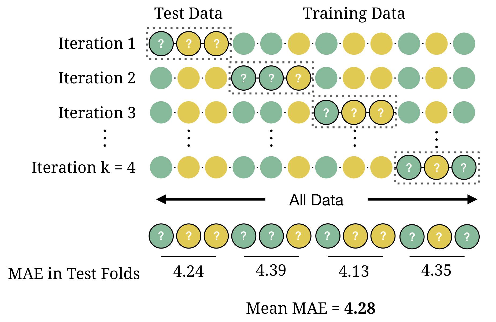

```{r setup, echo = FALSE}
knitr::opts_chunk$set(comment = NA, 
                      fig.width = 6, 
                      fig.height = 6,
                      fig.align = 'center',
                      echo = TRUE, 
                      eval = FALSE, 
                      warning = FALSE,
                      message = FALSE)

options(digits = 3)
```

```{r, echo = FALSE, fig.align = 'center', eval = TRUE, out.width = "100%"}

```

## {.tabset}

### Overview

By the end of this practical you will know how to:

1. Use cross-validation to select optimal model tuning parameters for decision trees and random forests
2. Compare 'standard' regression with lasso and ridge penalised regression
3. Use cross-validation to estimate future test accuracy

### Datasets

```{r, eval = TRUE, message = FALSE, echo = FALSE}
library(tidyverse)
library(ggthemes)
```

|File  |Rows | Columns |
|:----|:-----|:------|
|[hitters_train.csv](https://raw.githubusercontent.com/therbootcamp/appliedML_2019Jan/master/1_Data/hitters_train.csv)| 50 | 20|
|[hitters_test.csv](https://raw.githubusercontent.com/therbootcamp/appliedML_2019Jan/master/1_Data/_data/hitters_test.csv)| 213 | 20|
|[college_train.csv](https://raw.githubusercontent.com/therbootcamp/appliedML_2019Jan/master/1_Data/college_train.csv)| 500 | 18|
|[college_test.csv](https://raw.githubusercontent.com/therbootcamp/appliedML_2019Jan/master/1_Data/college_est.csv)| 277 | 18|
|[house_train.csv](https://raw.githubusercontent.com/therbootcamp/appliedML_2019Jan/master/1_Data/house_train.csv)| 5000 | 21|
|[house_test.csv](https://raw.githubusercontent.com/therbootcamp/appliedML_2019Jan/master/1_Data/_data/house_test.csv)| 1000 | 21|

```{r, message = FALSE, eval = TRUE, echo = FALSE}
# Load datasets locally
library(tidyverse)
college_train <- read_csv("https://raw.githubusercontent.com/therbootcamp/appliedML_2019Jan/master/1_Data/college_train.csv")
college_test <- read_csv("https://raw.githubusercontent.com/therbootcamp/appliedML_2019Jan/master/1_Data/college_test.csv")
house_train <- read_csv("https://raw.githubusercontent.com/therbootcamp/appliedML_2019Jan/master/1_Data/house_train.csv")
house_test <- read_csv("https://raw.githubusercontent.com/therbootcamp/appliedML_2019Jan/master/1_Data/house_test.csv")
hitters_train <- read_csv("https://raw.githubusercontent.com/therbootcamp/appliedML_2019Jan/master/1_Data/hitters_train.csv") %>%
  select(Salary, everything())
hitters_test <- read_csv("https://raw.githubusercontent.com/therbootcamp/appliedML_2019Jan/master/1_Data/hitters_test.csv") %>%
  select(Salary, everything())
```

- The `hitters_train` and `hitters_test` data are taken from the `Hitters` dataset in the `ISLR` package. To see column descriptions, run the following:

```{r, eval = FALSE}
library(ISLR)   # Load ISLR package
?Hitters        # Look at help menu for Hitters
```

- The `college_train` and `college_test` data are taken from the `College` dataset in the `ISLR` package. To see column descriptions, run the following:

```{r, eval = FALSE}
library(ISLR)   # Load ISLR package
?College        # Look at help menu for College
```

- The `hitters_train` and `hitters_test` data are taken from the `hitters` dataset in the `ISLR` package. To see column descriptions, run the following:

```{r, eval = FALSE}
library(ISLR)   # Load ISLR package
?hitters        # Look at help menu for hitters
```

- The `house_train` and `house_test` data come from [https://www.kaggle.com/harlfoxem/housesalesprediction](https://www.kaggle.com/harlfoxem/housesalesprediction)

### Glossary

| Function| Package | Description |
|:---|:------|:---------------------------------------------|
| `trainControl()`|`caret`|    Define modelling control parameters| 
| `train()`|`caret`|    Train a model|
| `predict(object, newdata)`|`stats`|    Predict the criterion values of `newdata` based on `object`|
| `postResample()`|`caret`|   Calculate aggregate model performance in regression tasks|
| `confusionMatrix()`|`caret`|   Calculate aggregate model performance in classification tasks| 


### Packages

|Package| Installation|
|:------|:------|
|`tidyverse`|`install.packages("tidyverse")`|
|`caret`|`install.packages("caret")`|
|`partykit`|`install.packages("partykit")`|
|`party`|`install.packages("party")`|

### Cheatsheet

<figure>
<center>
<a href="https://github.com/rstudio/cheatsheets/raw/master/caret.pdf">
  
  <figcaption>hhttps://github.com/rstudio/cheatsheets/raw/master/caret.pdf</figcaption></a>
</figure>

### Examples

```{r, eval = FALSE, echo = TRUE}
# Model optimization with Regression

# Step 0: Load packages-----------

library(tidyverse)    # Load tidyverse for dplyr and tidyr
library(caret)        # For ML mastery 
library(partykit)     # For decision trees
library(party)        # For decision trees

# Step 1: Load, clean, and explore data ----------------------

# training data
data_train <- read_csv("1_Data/diamonds_train.csv")

# test data
data_test <- read_csv("1_Data/diamonds_test.csv")

# Convert all characters to factor
#  Some ML models require factors

data_train <- data_train %>%
  mutate_if(is.character, factor)

data_test <- data_test %>%
  mutate_if(is.character, factor)

# Explore training data

data_train        # Print the dataset
View(data_train)  # Open in a new spreadsheet-like window 
dim(data_train)   # Print dimensions
names(data_train) # Print the names

# Define criterion_train
#   We'll use this later to evaluate model accuracy

criterion_train <- data_train$price
criterion_test <- data_test$price

# Step 2: Define training control parameters -------------

# Use 10-fold cross validation

ctrl_cv <- trainControl(method = "cv", 
                        number = 10) 

# Step 3: Train models: -----------------------------
#   Criterion: hwy
#   Features: year, cyl, displ

# Normal Regression --------------------------

price_glm <- train(form = price ~ carat + depth + table + x + y,
                   data = data_train,
                   method = "glm",
                   trControl = ctrl_cv)


# Print key results
price_glm

# RMSE  Rsquared  MAE
# 1506  0.86      921

# Coefficients
coef(price_glm$finalModel)

# (Intercept)       carat       depth       table           x           y 
#     21464.9     11040.4      -215.6       -94.2     -3681.6      2358.9 

# Lasso --------------------------

# Vector of lambda values to try
lambda_vec <- seq(0, 100, length = 100)

price_lasso <- train(form = price ~ carat + depth + table + x + y,
                   data = data_train,
                   method = "glmnet",
                   trControl = ctrl_cv,
                   preProcess = c("center", "scale"),  # Standardise
                   tuneGrid = expand.grid(alpha = 1,  # Lasso
                                          lambda = lambda_vec))


# Print key results
price_lasso

  # lambda  RMSE  Rsquared  MAE 
  #   0.00  1508  0.859      917
  #   1.01  1509  0.859      916
  #   2.02  1511  0.858      916

# Plot regularisation parameter versus error
plot(price_lasso)

# Print best regularisation parameter
price_lasso$bestTune$lambda

# Get coefficients from best lambda value

coef(price_lasso$finalModel, 
     price_lasso$bestTune$lambda)

# 6 x 1 sparse Matrix of class "dgCMatrix"
#                 1
# (Intercept)  4001
# carat        5179
# depth        -300
# table        -213
# x           -3222
# y            1755


# Ridge --------------------------

# Vector of lambda values to try
lambda_vec <- seq(0, 1000, length = 100)

price_ridge <- train(form = price ~ carat + depth + table + x + y,
                     data = data_train,
                     method = "glmnet",
                     trControl = ctrl_cv,
                     preProcess = c("center", "scale"),  # Standardise
                     tuneGrid = expand.grid(alpha = 0,  # Ridge penalty
                                            lambda = lambda_vec))

# Print key results
price_ridge

# lambda  RMSE  Rsquared  MAE 
#    0.0  1639  0.835     1137
#   10.1  1639  0.835     1137
#   20.2  1639  0.835     1137

# Plot regularisation parameter versus error
plot(price_ridge)

# Print best regularisation parameter
price_ridge$bestTune$lambda

# Get coefficients from best lambda value
coef(price_ridge$finalModel, 
     price_ridge$bestTune$lambda)

# 6 x 1 sparse Matrix of class "dgCMatrix"
#                1
# (Intercept) 4001
# carat       2059
# depth       -131
# table       -168
# x            716
# y            797

# Decision Trees --------------------------

# Vector of cp values to try
cp_vec <- seq(0, .4, length = 100)

price_dt <- train(form = price ~ carat + depth + table + x + y,
                  data = data_train,
                  method = "rpart",
                  trControl = ctrl_cv,
                  tuneGrid = expand.grid(cp = cp_vec))

# Print key results
price_dt

# Plot complexity parameter vs. error
plot(price_dt)

# Print best complexity parameter
price_dt$bestTune$cp

# [1] 0.00404

# Step 3: Estimate prediction accuracy from folds ----

# Get accuracy statistics across folds
resamples_price <- resamples(list(ridge = price_ridge, 
                                  lasso = price_lasso, 
                                  glm = price_glm))

# Print summary of accuracies
summary(resamples_price)

# MAE 
#       Min. 1st Qu. Median Mean 3rd Qu. Max. NA's
# ridge 1084    1098   1123 1137    1173 1214    0
# lasso  872     878    916  917     938  990    0
# glm    833     881    924  921     955 1030    0

# Step 4: Measure prediction Accuracy -------------------

# GLM ================================

# Predictions
glm_pred <- predict(price_glm, 
                    newdata = data_test)

# Calculate aggregate accuracy
postResample(pred = glm_pred, 
             obs = criterion_test)

#     RMSE Rsquared      MAE 
# 1654.017    0.832  944.854 

# Ridge ================================

# Predictions
ridge_pred <- predict(price_ridge, 
                      newdata = data_test)

# Calculate aggregate accuracy
postResample(pred = ridge_pred, 
             obs = criterion_test)

#     RMSE Rsquared      MAE 
# 1650.541    0.832 1133.063 


# Lasso ================================

# Predictions
lasso_pred <- predict(price_lasso, 
                      newdata = data_test)

# Calculate aggregate accuracy
postResample(pred = lasso_pred, 
             obs = criterion_test)

#     RMSE Rsquared      MAE 
# 1653.675    0.832  942.870 


# Visualise Accuracy -------------------------

# Tidy competition results
accuracy <- tibble(criterion_test = criterion_test,
                   Regression = glm_pred,
                   Ridge = ridge_pred,
                   Lasso = lasso_pred) %>%
               gather(model, prediction, -criterion_test) %>%
  
  # Add error measures
  mutate(se = prediction - criterion_test,
         ae = abs(prediction - criterion_test))

# Calculate summaries
accuracy_agg <- accuracy %>%
                  group_by(model) %>%
                  summarise(mae = mean(ae))   # Calculate MAE (mean absolute error)

# Plot A) Scatterplot of truth versus predictions

ggplot(data = accuracy,
       aes(x = criterion_test, y = prediction, col = model)) +
  geom_point(alpha = .5) +
  geom_abline(slope = 1, intercept = 0) +
  labs(x = "True Prices",
       y = "Predicted Prices",
       title = "Predicting Diamond Prices",
       subtitle = "Black line indicates perfect performance")

# Plot B) Violin plot of absolute errors

ggplot(data = accuracy, 
       aes(x = model, y = ae, fill = model)) + 
  geom_violin() + 
  geom_jitter(width = .05, alpha = .2) +
  labs(title = "Fitting Absolute Errors",
       subtitle = "Numbers indicate means",
       x = "Model",
       y = "Absolute Error") +
  guides(fill = FALSE) +
  annotate(geom = "label", 
           x = accuracy_agg$model, 
           y = accuracy_agg$mae, 
           label = round(accuracy_agg$mae, 2))
```

# Baseball player salaries

In this practical, we will predict the salaries of baseball players from the `hitters_train` and `hitters_test` datasets. Here's how the first few rows of `hitters_train` should look:

```{r, results = 'asis', echo = FALSE, eval = TRUE}
knitr::kable(hitters_train[1:10,])
```

Our goal will be to predict `Salary`.

## A - Setup

1. Open your `BaselRBootcamp` R project. It should already have the folders `1_Data` and `2_Code`. Make sure that the data file(s) listed in the `Datasets` section above are in your `1_Data` folder

2. Open a new R script. At the top of the script, using comments, write your name and the date. Save it as a new file called `Optimization_practical.R` in the `2_Code` folder.  
3. Using `library()` load the set of packages for this practical listed in the packages section above.

```{r, eval = FALSE, echo = TRUE}
## NAME
## DATE
## Optimization Practical - With regression, decision trees, and random forests

library(tidyverse)
library(caret)
library(party)
library(partykit)
```

```{r, message = FALSE, warning = FALSE, echo = FALSE, eval = TRUE}
library(tidyverse)
```

4. Run the code below to load each of the datasets listed in the `Datasets` as new objects

```{r, echo = TRUE, eval = FALSE, message = FALSE, warning = FALSE}
# hitters data
hitters_train <- read_csv(file = "1_Data/hitters_train.csv")
hitters_test <- read_csv(file = "1_Data/hitters_test.csv")
```

5. Take a look at the first few rows of each dataframe by printing them to the console.

```{r, echo = TRUE, eval = FALSE}
# Print dataframes to the console

hitters_train
hitters_test
```

6. Print the numbers of rows and columns of each dataset using the `dim()` function

```{r, echo = TRUE, eval = FALSE}
# Print numbers of rows and columns

dim(XXX)
dim(XXX)
```

7. Look at the names of the dataframes with the `names()` function.

```{r, echo = TRUE, eval = FALSE}
# Print the names of each dataframe

names(XXX)
names(XXX)
```

8. Open each dataset in a new window using `View()`. Do they look ok?

```{r}
# Open each dataset in a window.

View(XXX)
View(XXX)
```

9. We need to do a little bit of data cleaning before starting. Specifically, we need to convert all character columns to factors: Do this by running the following code:

```{r}
# Convert all character columns to factor

hitters_train <- hitters_train %>%
          mutate_if(is.character, factor)

hitters_test <- hitters_test %>%
          mutate_if(is.character, factor)
```


```{r, echo = FALSE}
data_train <- read_csv(file = "1_Data/hitters_train.csv") %>%
  slice(1:15)

data_test <- read_csv(file = "1_Data/hitters_test.csv")
```


## B - Setup `trainControl`

1. Set up your training by specifying `ctrl_cv` as 10-fold cross-validation

- Set method = "cv" to specify cross validation
- Set number = 10 to specify 10 folds

```{r}
# Use 10-fold cross validation
ctrl_cv <- trainControl(method = "XX", 
                        number = XX) 
```

## C - Regression (standard)

1. Fit a (standard) regression model predicting `Salary` as a function of all features

- Set the formula to `Salary ~ .`
- Set the data to `hitters_train`
- Set the method to `"glm"` for regular regression
- Set the train control argument to `ctrl_cv`

```{r, echo = TRUE, eval = FALSE}
# Normal Regression --------------------------

salary_glm <- train(form = XX ~ .,
                    data = XX,
                    method = "XX",
                    trControl = XX)
```


```{r, eval = FALSE, echo = FALSE}

salary_glm <- train(form = Salary ~ .,
                   data = hitters_train,
                   method = "glm",
                   trControl = ctrl_cv)
```

3. Print your `salary_glm` what do you see?

4. Try plotting your `salary_glm` object. What happens? What does this error mean?

5. Print your final model object with `salary_glm$finalModel`

```{r, echo = TRUE, eval = FALSE}
# Print final regression model
salary_glm$finalModel
```

6. Print your final regression model coefficients with `coef()`.

```{r}
# Print glm coefficients
coef(salary_glm$finalModel)
```

## D - Ridge Regression

It's time to fit an optimized regression model with a Ridge penalty!

1. Before we can fit a ridge regression model, we need to specify which values of the lambda penalty parameter we want to try. Using the code below, create a vector called `lambda_vec` which contains 100 values between 0 and 100

```{r, echo = TRUE, eval = FALSE}
# Determine possible values of lambda

lambda_vec <- seq(from = 0, to = 100, length = 100)
```

2. Fit a ridge regression model predicting `Salary` as a function of all features

- Set the formula to `Salary ~ .`
- Set the data to `hitters_train`
- Set the method to `"glmnet"` for regularized regression
- Set the train control argument to `ctrl_cv`
- Set the `preProcess` argument to `c("center", "scale")` to make sure the variables are standarised when estimating the beta weights (this is good practice for ridge regression)
- Set the tuneGrid argument such that alpha is 0 (for ridge regression), and with all lambda values you specified in `lambda_vec` (we've done this for you below)

```{r, echo = TRUE, eval = FALSE}
# Ridge Regression --------------------------

salary_ridge <- train(form = XX ~ .,
                      data = XX,
                      method = "XX",
                      trControl = XX,
                      preProcess = c("XX", "XX"),  # Standardise
                      tuneGrid = expand.grid(alpha = 0,  # Ridge penalty
                                             lambda = lambda_vec))
```

```{r, eval = FALSE, echo = FALSE}
# Fit a ridge regression

salary_ridge <- train(form = Salary ~ .,
                   data = hitters_train,
                   method = "glmnet",
                   trControl = ctrl_cv,
                   tuneGrid = expand.grid(alpha = 0,  # Ridge penalty
                                          lambda = lambda_vec))
```

3. Print your `salary_ridge` object what do you see?

4. Plot your `salary_ridge` object. What do you see? Which value of the regularization parameter seems to be the best?

```{r, echo = TRUE, eval = FALSE}
# Plot salary_ridge object
plot(XX)
```

5. Print the best value of lambda by running the following code. Does this match what you saw in the plot above?

```{r, echo = TRUE, eval = FALSE}
# Print best regularisation parameter
salary_ridge$bestTune$lambda
```

6. What were your final regression model coefficients for the best lambda value? Find them by running the following code:

```{r, echo = TRUE, eval = FALSE}
# Get coefficients from best lambda value
coef(salary_ridge$finalModel, 
     salary_ridge$bestTune$lambda)
```

7. How do these coefficients compare to what you found in regular regression? Are they similar? Different?

## E - Lasso Regression

It's time to fit an optimized regression model with a Lasso penalty!

1. Before we can fit a lasso regression model, we need to specify which values of the lambda penalty parameter we want to try. Using the code below, create a vector called `lambda_vec` which contains 100 values between 0 and 100

```{r, echo = TRUE, eval = FALSE}
# Determine possible values of lambda

lambda_vec <- seq(from = 0, to = 100, length = 100)
```

2. Fit a lasso regression model predicting `Salary` as a function of all features

- Set the formula to `Salary ~ .`
- Set the data to `hitters_train`
- Set the method to `"glmnet"` for regularized regression
- Set the train control argument to `ctrl_cv`
- Set the `preProcess` argument to `c("center", "scale")` to make sure the variables are standarised when estimating the beta weights (this is good practice for lasso regression)
- Set the tuneGrid argument such that alpha is 1 (for lasso regression), and with all lambda values you specified in `lambda_vec` (we've done this for you below)

```{r, echo = TRUE, eval = FALSE}
# Lasso Regression --------------------------

salary_lasso <- train(form = XX ~ .,
                      data = XX,
                      method = "XX",
                      trControl = XX,
                      preProcess = c("XX", "XX"),  # Standardise
                      tuneGrid = expand.grid(alpha = 1,  # Lasso penalty
                                            lambda = lambda_vec))
```

```{r, eval = FALSE, echo = FALSE}
# Fit a lasso regression

salary_lasso <- train(form = Salary ~ .,
                   data = hitters_train,
                   method = "glmnet",
                   trControl = ctrl_cv,
                   preProcess = c("center", "scale"),
                   tuneGrid = expand.grid(alpha = 1,  # Lasso penalty
                                          lambda = lambda_vec))
```

3. Print your `salary_lasso` object what do you see?

4. Plot your `salary_lasso` object. What do you see? Which value of the regularization parameter seems to be the best?

```{r, echo = TRUE, eval = FALSE}
# Plot salary_lasso object
plot(XX)
```

5. Print the best value of lambda by running the following code. Does this match what you saw in the plot above?

```{r, echo = TRUE, eval = FALSE}
# Print best regularisation parameter
salary_lasso$bestTune$lambda
```

6. What were your final regression model coefficients for the best lambda value? Find them by running the following code:

```{r, echo = TRUE, eval = FALSE}
# Get coefficients from best lambda value
coef(salary_lasso$finalModel, 
     salary_lasso$bestTune$lambda)
```

7. How do these coefficients compare to what you found in regular regression? Are they similar? Different? Do you notice that any coefficients are now set to exactly 0?

## F - Decision Tree

It's time to fit an optimized decision tree model!!

1. Before we can fit a decision tree, we need to specify which values of the complexity parameter `cp` we want to try. Using the code below, create a vector called `cp_vec` which contains 100 values between 0 and 1

```{r, echo = TRUE, eval = FALSE}
# Determine possible values of the complexity parameter cp

cp_vec <- seq(from = 0, to = 1, length = 100)
```

2. Fit a decision tree model predicting `Salary` as a function of all features

- Set the formula to `Salary ~ .`
- Set the data to `hitters_train`
- Set the method to `"rpart"` for decision trees
- Set the train control argument to `ctrl_cv`
- Set the tuneGrid argument with all `cp` values you specified in `cp_vec`

```{r, echo = TRUE, eval = FALSE}
# Decision Tree --------------------------

salary_dt <- train(form = XX ~ .,
                  data = XX,
                  method = "XX",
                  trControl = XX,
                  tuneGrid = expand.grid(cp = cp_vec))
```

```{r, eval = FALSE, echo = FALSE}
# Decision Tree --------------------------

salary_dt <- train(form = Salary ~ .,
                  data = hitters_train,
                  method = "rpart",
                  trControl = ctrl_cv,
                  tuneGrid = expand.grid(cp = cp_vec))
```

3. Print your `salary_dt` object what do you see?

4. Plot your `salary_dt` object. What do you see? Which value of the regularization parameter seems to be the best?

```{r, echo = TRUE, eval = FALSE}
# Plot salary_dt object
plot(XX)
```

5. Print the best value of lambda by running the following code. Does this match what you saw in the plot above?

```{r, echo = TRUE, eval = FALSE}
# Print best regularisation parameter
salary_dt$bestTune$cp
```

6. Plot your final decision tree using the following code

```{r, echo = TRUE, eval = FALSE}
# Visualise your trees
plot(as.party(salary_dt$finalModel)) 
```

7. How do the nodes in the tree compare to the coefficients you found in your regression analyses? Do you see similarities or differences?

## G - Random Forests

It's time to fit an optimized random forest model!

1. Before we can fit a random forest model, we need to specify which values of the diversity parameter `mtry` we want to try. Using the code below, create a vector called `mtry_vec` which is a sequence of numbers from 1 to 10

```{r, echo = TRUE, eval = FALSE}
# Determine possible values of the random forest diversity parameter mtry

mtry_vec <- 1:10
```

2. Fit a random forest model predicting `Salary` as a function of all features

- Set the formula to `Salary ~ .`
- Set the data to `hitters_train`
- Set the method to `"rf"` for random forests
- Set the train control argument to `ctrl_cv`
- Set the tuneGrid argument such that mtry can take on the values you defined in `mtry_vec`

```{r, echo = TRUE, eval = FALSE}
# Random Forest --------------------------

salary_rf <- train(form = XX ~ .,
                   data = XX,
                   method = "XX",
                   trControl = XX,
                   tuneGrid = expand.grid(mtry = mtry_vec))
```

```{r, eval = FALSE, echo = FALSE}
# Random Forest --------------------------

salary_rf <- train(form = Salary ~ .,
                   data = hitters_train,
                   method = "rf",
                   trControl = ctrl_cv,
                   tuneGrid = expand.grid(mtry = mtry_vec))
```

3. Print your `salary_rf` object what do you see?

4. Plot your `salary_rf` object. What do you see? Which value of the regularization parameter seems to be the best?

```{r, echo = TRUE, eval = FALSE}
# Plot salary_rf object
plot(XX)
```

5. Print the best value of mtry by running the following code. Does this match what you saw in the plot above?

```{r, echo = TRUE, eval = FALSE}
# Print best mtry parameter
salary_rf$bestTune$mtry
```

## H - Estimate prediction accuracy from training folds

1. Using `resamples()`, calculate the estimated prediction accuracy for each of your models. To do this, put your model objects in the named list (e.g.; `glm = salary_glm`, ...)

```{r}
# Summarise accuracy statistics across folds

salary_resamples <- resamples(list(glm = XXX,
                                   ridge = XXX, 
                                   lasso = XXX, 
                                   dt = XXX, 
                                   rf = XXX))
```

2. Look at the summary of your `salary_resamples` object with `summary(salary_resamples)`. What does this tell you? Which model do you expect to have the best prediction accuracy for the test data?

```{r}
# Print summaries of cross-validation accuracy 
summary(salary_resamples)
```

## I - Calculate prediction accuracy

1. Save the criterion value for the test data as a new vector called `criterion_test`

```{r}
# Save salaries of players in test dataset as criterion_test
criterion_test <- XXX$XXX
```

2. Using `predict()`, save the prediction of your regular regression model `salary_glm` for the `hitters_test` data as a new object called `glm_pred`:

- Set the first argument to `salary_glm`
- Set the newdata argument to `hitters_test`

```{r}
# Save the glm predicted salaries of hitters_test
glm_pred <- predict(XXX, newdata = XXX)
```

3. Now do the same with your ridge, lasso, decision tree, and random forest models to get the objects `ridge_pred`, `lasso_pred`, `dt_pred` and `rf_pred`

```{r}
ridge_pred <- predict(XXX, newdata = XXX)
lasso_pred <- predict(XXX, newdata = XXX)
dt_pred <- predict(XXX, newdata = XXX)
rf_pred <- predict(XXX, newdata = XXX)
```

4. Using `postResample()`, calculate the aggregate prediction accuracy for each model using the template below

- Set the pred argument to your model predictions (e.g.; `ridge_pred`)
- Set the `obs` argument to the true criterion values `criterion_test`)

```{r}
# Calculate aggregate accuracy for a model
postResample(pred = XXX, 
             obs = XXX)
```

5. Which of your four models had the best performance in the true training data?

6. How close were your models' true prediction values to the values you estimated in the previous section when you ran `resamples()`?

## Z - Challenges

1. In addition to 'regular' 10 fold cross-validation, you can also do repeated 10-fold cross-validation, where the cross validation procedure is repeated many times. Do you think this will improve your models' performance? To test this, create a new training control object called `ctrl_cv_rep` as below. Then, train your models again using `ctrl_cv_rep` (instead of `ctrl_cv`), and evaluate their prediction performance. Do they improve? Do you get different optimal tuning values compared to your previous models?

```{r}
# Repeated cross validation.
#  Folds = 10
#  Repeats = 5

ctrl_cv_rep <- trainControl(method = "repeatedcv",
                            number = 10,
                            repeats = 5)
```

2. Using the same procedure as above, compare models predicting the prices of houses in King County Washington using the `house_train` and `house_test` datasets. 

3. When using lasso regression, do you find that the lasso sets any beta weights to exactly 0? If so, which ones?

4. Which model does the best and how accurate was it? Was it the same model that performed the best predicting baseball player salaries?

5. Using the same procedure as above, compare models predicting the graduate rate of students from different colleges using the `college_train` and `college_test` datasets. 

6. When using lasso regression, do you find that the lasso sets any beta weights to exactly 0? If so, which ones?

7. Which model does the best and how accurate was it? Was it the same model that performed the best predicting baseball player salaries?

