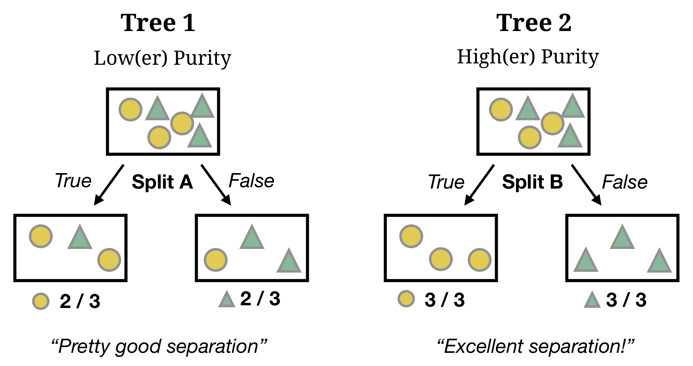
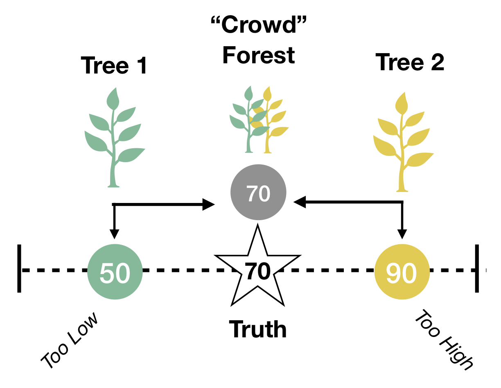

layout: true

<div class="my-footer"><span>
<a href="https://therbootcamp.github.io/"><font color="#7E7E7E">Applied Machine Learning with R, January 2019</font></a>
&emsp;&emsp;&emsp;&emsp;&emsp;&emsp;&emsp;&emsp;&emsp;&emsp;&emsp;&emsp;&emsp;&emsp;&emsp;&emsp;&emsp;&emsp;&emsp;&emsp;
<a href="https://therbootcamp.github.io/"><font color="#7E7E7E">www.therbootcamp.com</font></a>
</span></div> 

---
class: center, middle

```{r setup, include=FALSE}
options(htmltools.dir.version = FALSE)
# see: https://github.com/yihui/xaringan
# install.packages("xaringan")
# see: 
# https://github.com/yihui/xaringan/wiki
# https://github.com/gnab/remark/wiki/Markdown
options(width=110)
options(digits = 4)
```

```{r, echo = FALSE ,message = FALSE, warning = FALSE}
knitr::opts_chunk$set(comment=NA, fig.width=6, fig.height=6, echo = TRUE, eval = TRUE, 
                      message = FALSE, warning = FALSE, fig.align = 'center', dpi = 200)
library(tidyverse)
library(baselers)
library(ggthemes)
library(knitr)

set.seed(100)

past <- tibble(id = 1:5,
               sex = sample(c("m", "f"), size  = 5, replace = TRUE),
               age = round(rnorm(5, mean = 45, sd = 5), 0),
               fam_history = sample(c("Yes", "No"), size = 5, replace = TRUE),
               smoking = sample(c(TRUE, FALSE), size = 5, replace = TRUE),
               disease = sample(c(0, 1), size = 5, replace = TRUE))

present <- tibble(id = 91:95,
                  sex = sample(c("m", "f"), size  = 5, replace = TRUE),
               age = round(rnorm(5, mean = 45, sd = 5), 0),
               fam_history = sample(c("Yes", "No"), size = 5, replace = TRUE),
               smoking = sample(c(TRUE, FALSE), size = 5, replace = TRUE),
               disease = rep("?", 5))


```


---

 ## "Prediction is very difficult, especially if it's about the future."
 ## ~  Nils Bohr, Nobel Laureate in Physics

---
class: middle, center

 ## "An economist is an expert who will know tomorrow why the things he predicted yesterday didn't happen today. "
 ## ~ Evan Esar

---
class: middle, center


 ## "Forecasting is the art of saying what will happen, and then explaining why it didn't!"
 ## ~ Anonymous

---

<br><br>
```{r, echo = FALSE, fig.align = 'center', out.width = "100%", fig.cap = "Source: Medium.com"}
knitr::include_graphics("https://cdn-images-1.medium.com/max/1600/1*_QGyIwpgq831xI54cIe_GQ.jpeg")
```


---

.pull-left45[
## What is model Testing?

Model testing is the process of accessing a model's predictions on *new, unseen* data.

]

.pull-right5[

```{r, echo = FALSE, fig.align = 'center', out.width = "100%", fig.cap = "Source: Medium.com"}
knitr::include_graphics("https://cdn-images-1.medium.com/max/1600/1*_QGyIwpgq831xI54cIe_GQ.jpeg")
```


]


---

# Why do we separate training from prediction?

.pull-left35[
<br>

## Just because a model can <high>fit past data well</high>, does *not* necessarily mean that it will <high>predict new data well</high>.

]
 
.pull-right6[

<p align="center">
  
</p>


]

---
<br><br>
<font size = 6>"Can you come up with a model that will perfectly match past data but is worthless in predicting future data?"</font><br><br>


.pull-left45[

<br>
<font size=5><hfont>Past <high>Training</high> Data</hfont></font>

<br>

```{r, results = 'asis', echo = FALSE}
knitr::kable(past, format = "markdown")
```

]


.pull-right45[

<br>
<font size=5><hfont>Future <high> Test</high> Data</hfont></font>

<br>

```{r, echo = FALSE}
knitr::kable(present, format = "markdown")
```

]


---

## Overfitting - Examples


.pull-left5[


]


.pull-right45[


]


---
class: middle, center

## Can you think of a model that perfectly fits this data...
##  But is totally useless in predicting future data?


```{r}
df <- data.frame(id = c(1, 2, 3, 4, 5),
                 sex = c("m", "f", "f", "m", "f"),
                 age = c(54, 27, 53, 38, 43),
                 drug = c("X", "Y", "X", "Y", "X"),
                 success = c("Yes", "No", "Yes", "No", "Yes"))

df %>% kable()
```


---

.pull-left4[

# How do you measure prediction performance?

]

.pull-right6[

]


---

.pull-left4[

# Why do we nee

What is the purpose of a model?

Separating signal from noise.
What is noise? Things you can't predict
What is signal? Thanks you can predict.

Trick: Don't trick yourself into thinking you can predict things you can't.

]


.pull-right55[


]


---

.pull-left4[

# What are reasons why prediction performance can differ from training?

]

.pull-right6[

]

---

.pull-left4[

# How do you know if a model's predictions are 'good'?

- Compare to baseline models
- Compare multiple models!
- Define meaningful performance levels (aka, costs) *a priori* 

]

.pull-right6[

]

---

.pull-left4[

# What are good baseline models of performance?

]

.pull-right6[

]

---

.pull-left4[

# What are reasons why prediction performance can differ from training?

- Random chance (you got lucky!)

- You fit an overly complex model

]

.pull-right6[

]


---

.pull-left4[

# Decision Trees

In [decision trees](https://en.wikipedia.org/wiki/Decision_tree), the criterion is modeled as a <high>sequence of logical YES or NO questions</high>.
<br><br>

<p align="center">
  
</p>

]

.pull-right55[

### Fitting

Goal: Maximize accuracy by define splits that maximize *Node Purity*

```{r, echo = FALSE, out.width = "100%"}

```

### R Method

| Variant | Description| Caret |
|:-----|:------|:---|
|rpart |Recursive Partitioning| `"rpart"`|

]

---

.pull-left4[

# Random Forest

In [Random Forest](https://en.wikipedia.org/wiki/Random_forest), the criterion is models as the <high>aggregate prediction of a large number of decision trees</high> each based on different features.
<br>

<p align="center">
  <br>
  <a href="https://medium.com/@williamkoehrsen">Source</a>
</p>

]

.pull-right55[

### Fitting

Goal: Create a large set of diverse trees that can be aggregated into one *Wisdom of Crowds* judgment

```{r, echo = FALSE, out.width = "60%"}

```

### R Method

| Variant | Description| Caret |
|:-----|:------|:---|
|Random Forests |"Classic" random forests| `"rf"`|

]


---

# Caret


---


# Practical

<font size=6><b><a href="https://therbootcamp.github.io/Intro2DataScience_2018Oct/_sessions/Plotting/Plotting_practical.html">Link to practical</a>


