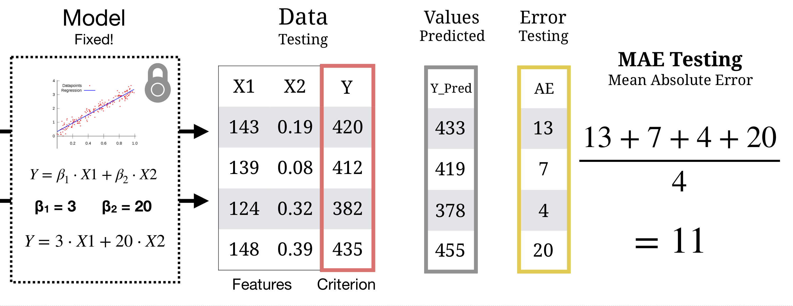

layout: true

<div class="my-footer">
  <span style="text-align:center">
    <span> 
      
    </span>
    <a href="https://therbootcamp.github.io/">
      <span style="padding-left:82px"> 
        <font color="#7E7E7E">
          www.therbootcamp.com
        </font>
      </span>
    </a>
    <a href="https://therbootcamp.github.io/">
      <font color="#7E7E7E">
       Applied Machine Learning with R | January 2019
      </font>
    </a>
    </span>
  </div> 

---


```{r setup, include=FALSE}
library(tidyverse)
options(htmltools.dir.version = FALSE)
# see: https://github.com/yihui/xaringan
# install.packages("xaringan")
# see: 
# https://github.com/yihui/xaringan/wiki
# https://github.com/gnab/remark/wiki/Markdown
options(width=110)
options(digits = 4)

source("https://raw.githubusercontent.com/therbootcamp/therbootcamp.github.io/master/_materials/code/baselrbootcamp_palettes.R")


baselers <- read_csv("../../1_Data/baselers.csv")
```

```{r, echo = FALSE ,message = FALSE, warning = FALSE}
knitr::opts_chunk$set(comment=NA, fig.width=6, fig.height=6, echo = TRUE, eval = TRUE, 
                      message = FALSE, warning = FALSE, fig.align = 'center', dpi = 200)
library(tidyverse)
library(baselers)
library(ggthemes)
library(knitr)

set.seed(100)

past <- tibble(id = 1:5,
               sex = sample(c("m", "f"), size  = 5, replace = TRUE),
               age = round(rnorm(5, mean = 45, sd = 5), 0),
               fam_history = sample(c("Yes", "No"), size = 5, replace = TRUE),
               smoking = sample(c(TRUE, FALSE), size = 5, replace = TRUE),
               criterion = sample(c(0, 1), size = 5, replace = TRUE))

present <- tibble(id = 91:95,
                  sex = sample(c("m", "f"), size  = 5, replace = TRUE),
               age = round(rnorm(5, mean = 45, sd = 5), 0),
               fam_history = sample(c("Yes", "No"), size = 5, replace = TRUE),
               smoking = sample(c(TRUE, FALSE), size = 5, replace = TRUE),
               criterion = rep("?", 5))
```


# Prediction is...

<br><br>
<i>"Prediction is very difficult, especially if it's about the future."</i>

Nils Bohr, Nobel Laureate in Physics

<br>

<i>"An economist is an expert who will know tomorrow why the things he predicted yesterday didn't happen today."</i>

Evan Esar

<br>

<i>"Forecasting [prediction] is the art of saying what will happen, and then explaining why it didn't!"</i>

Anonymous

---

<br><br>
```{r, echo = FALSE, fig.align = 'center', out.width = "100%", fig.cap = "Source: Medium.com"}
knitr::include_graphics("https://cdn-images-1.medium.com/max/1600/1*_QGyIwpgq831xI54cIe_GQ.jpeg")
```

---
class: middle, center

# What is model prediction?

<font size = 5>Model prediction (aka, testing) is the process of computing a model's predictions on <i>new</i> <high>test data</high>.</font>

<br><br>

# What is test data? 

<font size = 5>Test data is a separate, <high>'hold-out' data</high> set that the model <high>never saw during training</high></font>

---

# Model Training

```{r, echo = FALSE}
knitr::include_graphics("image/model_training_flow.png")
```

---
# Model Testing


```{r, echo = FALSE}

```


---

# Why do we separate training from testing?

.pull-left35[
<br>
Just because a model can <high>fit past data well</high> (high training accuracy), does <i>not</i> necessarily mean that it will <high>predict new data well</high> (high testing accuracy).

<br><br>

<p align="center"><i>"An economist is an expert who will know tomorrow why the things he predicted yesterday didn't happen today."</i></p>
<p align="right">
Evan Esar
</p>

]
 
.pull-right6[

<p align="center">
  
</p>


]

---
<br><br><br>
<p align = "center"><font size = 6><i>"Can you come up with a model that will perfectly fit the training criterion but is worthless in predicting test data?"</i></font><br><br>

.pull-left45[


<high>Training data</high>
<br>

```{r, results = 'asis', echo = FALSE}
knitr::kable(past, format = "markdown")
```

]

.pull-right45[


<high> Test data</high>
<br>

```{r, echo = FALSE}
knitr::kable(present, format = "markdown")
```

]


---


.pull-left4[
<br><br><br>

# Overfitting

When a model is consistently <high>less accurate in predicting future data</high> than in <high>fitting training data</high>, this is called <high>overfitting</high>

Overfitting typically occurs when a model 'mistakes' random noise for a predictable signal

]


.pull-right55[
<br><br><br>
```{r, echo = FALSE, fig.cap = "<font size = 3>hackernoon.com</font>"}
knitr::include_graphics("https://cdn-images-1.medium.com/max/1600/1*SBUK2QEfCP-zvJmKm14wGQ.png")
```

```{r, echo = FALSE,  fig.cap = "<font size = 3>Medium.com</font>", out.width="90%"}
knitr::include_graphics("https://cdn-images-1.medium.com/max/1200/1*cdvfzvpkJkUudDEryFtCnA.png")
```


]


---

# Overfitting

```{r, fig.width = 8, fig.height = 3.5, echo = FALSE, eval = TRUE, warning = FALSE, dpi = 200}
set.seed(5)

N <- 40

iv <- rnorm(N, mean = 10, sd = 2)
truth <- iv 
noise <- rnorm(N, mean = 0, sd = 2)
obs <- truth + noise

data <- data.frame(iv, obs)


poly_pred <- map_dfc(.x = c(1, 19), .f = function(degree) {
  
  output <- data.frame(lm(obs ~ poly(iv, degree), data = data)$fitted.values)
  
  names(output) <- paste0("d", degree)
  
  return(output)

}) %>% mutate(id = 1:N,
              x = iv,
              obs = obs) %>%
  gather(Degree, pred, -id, -x, -obs) %>%
  mutate(`Training` = abs(pred - obs))


poly_pred <- poly_pred %>%
  mutate(Degree = case_when(Degree == "d1" ~ "Simple",
                            TRUE ~ "Complex"))


overfit_gg <- ggplot(poly_pred, aes(x = x, y = pred, col = Degree)) + 
  geom_line(size = 1.5) +
  geom_point(aes(x = x, y = obs), col = "black", pch = 21) +
  annotate("segment", x = 5, y = 5, xend = 15, yend = 15, col = "black", linetype = 4, size = 1) +
  xlim(5, 15) +
  ylim(5, 15) +
  labs(title = "Model overfitting",
       subtitle = "Dashed line is TRUE model") +
  theme_bw() +
    theme(legend.position="bottom") +
  scale_color_baselrbootcamp()
  
poly_pred <- poly_pred %>% mutate(

  obs_new = x + rnorm(1, mean = 0, sd = 2),
  `Testing` = abs(obs_new - pred)
  
)


poly_pred <- poly_pred %>%
  select(Degree, `Training`, `Testing`) %>%
  gather(phase, Error, -Degree)

agg <- poly_pred %>%
  group_by(Degree, phase) %>%
  summarise(Error = mean(Error)) %>%
  ungroup() %>%
  mutate(phase = factor(phase, levels = c("Training", "Testing"), ordered = TRUE))
 
fit_gg <- ggplot(agg, aes(x = phase, y = Error, fill = Degree)) +
  geom_bar(position = "dodge", stat = "identity") +
  labs(title = "Fitting versus Prediction Error",
       subtitle = "Smaller values are better!",
       x = "Modelling Phase") +  
  scale_y_continuous(limits=c(.75,1.25),oob = scales::rescale_none) +
  theme_bw() +
    theme(legend.position="bottom") +
  scale_fill_baselrbootcamp()

ggpubr::ggarrange(overfit_gg, fit_gg)
```


---

# Overfitting

.pull-left45[

### How do we account for overfitting?

Always evaluate models based on their performance on new, unseen test data

*Never evaluate models based only on training accuracy!*

Use models with <high>regularization</high> terms, which explicitly punish models for being too complex.

Use fitting methods such as <high>cross-validation</high> to find optimal regularization values.

We will learn about these methods in a future session!

]

.pull-right5[

```{r, echo = FALSE, fig.width = 4, fig.height = 3.5}
fit_gg
```


]


---

# How do I get separate training and test data?

.pull-left5[

If you don't have two naturally occurring distinct training and test dataset, you can <high>randomly split</high> a dataset into an <high>X% training</high> set and <high>1-X% testing</high> set.

The `caret` function `createDataPartition()` helps you do this automatically.

<u>Natural examples</u>

|Domain|Training|Test|
|:-------|:------|:------|
|Stock prediction|2017 Trends | 2019 Trends|
|Medical diagnosis| Patients from Hospital A| Patients from Hospital B|
|Crime rates|Statistics from City X|Statistics from City Y|


]

.pull-right45[


```{r, echo = FALSE, out.width = "88%"}

```


]


---
class: center, middle

# Two new models enter the ring...

---
class: center, middle

<font color = "gray"><h1>Regression</h1></font>

<high><h1>Decision Trees</h1></high>

<font color = "gray"><h1>Random Forests</h1></font>


---

# Decision Trees

.pull-left4[

In [decision trees](https://en.wikipedia.org/wiki/Decision_tree), the criterion is modeled as a <high>sequence of logical YES or NO questions</high>.
<br><br>

<p align="center">
  
</p>

]

.pull-right55[

<high>Grow Decisions Trees</high> by splitting features that maximize *Node Purity*.
<br><br>
```{r, echo = FALSE, out.width = "100%"}
knitr::include_graphics("image/tree_purity_example.png")
```

]

---

# Decision Trees

.pull-left4[

In [decision trees](https://en.wikipedia.org/wiki/Decision_tree), the criterion is modeled as a <high>sequence of logical YES or NO questions</high>.
<br><br>

<p align="center">
  
</p>

]

.pull-right55[

<high>Fit a Decision Tree</high> in `caret` using `method = "rpart"`.

```{r, eval = FALSE}
# Fit a decision tree with a defined cp = .10

train(form = income ~ .,
      data = baselers,
      method = "rpart",  # Decision Tree
      trControl = ctrl,
      tuneGrid = expand.grid(cp = .10)) # cp
```


]


---

# Decision Trees

.pull-left45[

### Complexity Parameter

Decision trees have a <high>complexity parameter</high> called `cp`.

The `cp` parameter controls how complex (i.e.; large) trees are allowed to grow

- <high>Small</high> cp (< 0.01) = <high>Complex</high> Trees
- <high>Large</high> cp (> 0.10) = <high>Simple</high> Trees

There is no "one" best value of `cp` -- the best value of cp depends on your needs and your dataset!

]


.pull-right5[

```{r, echo = FALSE, out.width = "100%"}
knitr::include_graphics("image/complexity_parameter.png")
```

]


---

# Decision Trees

.pull-left45[
### Complexity Parameter

Decision trees have a <high>complexity parameter</high> called `cp`.

The `cp` parameter controls how complex (i.e.; large) trees are allowed to grow

- <high>Small</high> cp (< 0.01) = <high>Complex</high> Trees
- <high>Large</high> cp (> 0.10) = <high>Simple</high> Trees

There is no "one" best value of `cp` -- the best value of cp depends on your needs and your dataset!


]

.pull-right5[

### Decision Trees in Caret: rpart

When fitting a decision tree, the `cp` parameter can be defined by the user in the `tuneGrid` argument:

```{r, eval = FALSE}
# Fit a decision tree with a defined cp = .10

train(form = income ~ .,
      data = baselers,
      method = "rpart",  # Decision Tree
      trControl = ctrl,
      tuneGrid = expand.grid(cp = .10)) # cp
```

- `cp` can also be optimally determined through methods such as <high>cross-validation</high>, which we will learn later

]


---
class: center, middle

<font color = "gray"><h1>Regression</h1></font>

<font color = "gray"><h1>Decision Trees</h1></font>

<high><h1>Random Forests</h1></high>

---

# Random Forest

.pull-left4[

In [Random Forest](https://en.wikipedia.org/wiki/Random_forest), the criterion is modeled as the <high>aggregate prediction of a large number of decision trees</high> each based on different features.
<br>

<p align="center">
  <br>
  <a href="https://medium.com/@williamkoehrsen">Source</a>
</p>

]

.pull-right55[

In Random Forests, we create a large set of <high>diverse trees</high> that can be aggregated into one <high>Wisdom of Crowds</high> judgment.

```{r, echo = FALSE, out.width = "80%"}
knitr::include_graphics("image/tree_crowd.png")
```

]


---

# Random Forest

.pull-left4[

In [Random Forest](https://en.wikipedia.org/wiki/Random_forest), the criterion is modeled as the <high>aggregate prediction of a large number of decision trees</high> each based on different features.
<br>

<p align="center">
  <br>
  <a href="https://medium.com/@williamkoehrsen">Source</a>
</p>

]

.pull-right55[

To <high>fit a random forest</high> in caret, use `method = "rf"`.

```{r, eval = FALSE}
# Fit a random forest with a defined mtry = 3

train(form = income ~ .,
      data = baselers,
      method = "rf",  # Random Forest
      trControl = ctrl,
      tuneGrid = expand.grid(mtry = 3))
```

]

---

# Random Forest

.pull-left4[

### Diversity Parameter: mtry

Random Forests have a <high>diversity parameter</high> called <high>mtry</high>

Technically, this controls how many features are randomly considered at each split of the trees

- Small mtry (~ 1) = Diverse Forest
- Large mtry (> 5) = Similar Forest

There is no "one" best value of `mtry` -- the best value of `mtry` depends on your needs and your dataset!

]

.pull-right55[

```{r, echo = FALSE, out.width = "90%"}

```

]

---

# Random Forest

.pull-left4[

### Diversity Parameter: mtry

Random Forests have a <high>diversity parameter</high> called <high>mtry</high>

Technically, this controls how many features are randomly considered at each split of the trees

- Small mtry (~ 1) = Diverse Forest
- Large mtry (> 5) = Similar Forest

There is no "one" best value of `mtry` -- the best value of `mtry` depends on your needs and your dataset!

]

.pull-right55[

When fitting a random forest, the `mtry` parameter can be defined by the user in the `tuneGrid` argument.

```{r, eval = FALSE}
# Fit a random forest with a defined mtry = 2

train(form = income ~ .,
      data = baselers,
      method = "rpart",  # Decision Tree
      trControl = ctrl,
      tuneGrid = expand.grid(mtry = 2)) # mtry
```

- `mtry` can also be optimally determined through methods such as <high>cross-validation</high>, which we will learn later

]

---
class: center,  middle

<br><br>

# Evaluating model predictions with caret

```{r, echo = FALSE, out.width = "70%"}
knitr::include_graphics("https://3qeqpr26caki16dnhd19sv6by6v-wpengine.netdna-ssl.com/wp-content/uploads/2014/09/Caret-package-in-R.png")
```


```{r, echo = FALSE}
library(caret)
data(cars)
```


---

# Predict new data with predict()

.pull-left45[

To <high>test model predictions</high> with `caret`, all you need to do is get a vector of predictions from a new dataframe `newdata` using the `predict()` function:

```{r, eval = FALSE}
# Get predictions for test data!
predict(mod, newdata = data_test)
```

<br>

|argument|description|
|:----|:-----|
|object| A machine learning / statistical object created from `caret`, ...|
|newdata|A dataframe of new data|

This returns a vector of predicted values for your new data!


]

.pull-right5[

<high>Get predictions</high>, use `predict(mod, newdata = data_test)`

```{r, eval = FALSE}
# Load training and test data
data_train <- read_csv("1_Data/XXX_train.csv")
data_test <- read_csv("1_Data/XXX_test.csv")

# Fit model to training data
mod <- train(form = Y ~ .,
             method = "glm",
             data = data_train)

# Get fitted values (for training data)
mod_fit <- predict(mod)

# Predictions for NEW data_test data!
mod_pred <- predict(mod, newdata = data_test)
```


]


---

# Predict new data with predict()

.pull-left45[

To <high>test model predictions</high> with `caret`, all you need to do is get a vector of predictions from a new dataframe `newdata` using the `predict()` function:

```{r, eval = FALSE}
# Get predictions for test data!
predict(mod, newdata = data_test)
```

|argument|description|
|:----|:-----|
|object| A machine learning / statistical object created from `caret`, ...|
|newdata|A dataframe of new data|

This returns a vector of predicted values for your new data!

]

.pull-right5[

Compare predictions to the criterion with `postResample()`

```{r, eval = FALSE}
# Define criterion
criterion_train <- data_train$Y
criterion_test <- data_test$Y

# Fitting performance
postResample(pred = mod_fit, 
             obs = criterion_train)

#    RMSE Rsquared      MAE 
#2.454015 0.848482 1.889584 

# Prediction performance
postResample(pred = mod_pred, 
             obs = criterion_test)

#     RMSE  Rsquared       MAE 
#3.4763941 0.6977009 2.6764346 
```


]

---


# Split data with createDataPartition()

.pull-left4[

Use `createDataPartition()` to <high>split a dataset</high> into separate training and test datasets

```{r, echo = FALSE, warning=F, message=F}
library(caret)
data <- baselers %>% drop_na() # Drop missing cases
```

```{r, eval = FALSE, echo = TRUE}
# Create a set of indices for random 
# selection of 70% of data

createDataPartition(y = data$Y
                    p = .7,
                    list = FALSE)
```

|Argument|Description|
|:----|:-----|
|y| The criterion|
|p|Percent of data to select|

This returns a vector of indices you can then use to select rows (see right)

]

.pull-right55[

Create separate `XX_train` and `data_test` datasets from a single 'large' dataset

```{r, eval = FALSE, echo = TRUE}
# Set the randomisation seed to get the 
#  same results each time
set.seed(100)

# Get indices for training
index <- createDataPartition(y = baselers$income,
                             p = .7,
                             list = FALSE)

# Create training data
baselers_train <- baselers %>% 
  slice(index)

# Create test data
baselers_test <- baselers %>% 
  slice(-index)
```


]


---
.pull-left5[

# 5 steps with caret

Step 0: Load training and test data (or create with `createDataPartition()`)

```{r, eval = FALSE}
data_train <- read_csv("1_Data/XXX_train.csv")
data_test <- read_csv("1_Data/XXX_test.csv")
```

Step 1: Define control parameters

```{r, eval = FALSE}
# Use method = "none" for no advanced fitting
ctrl <- trainControl(method = "none")
```

Step 2: Train model

```{r, eval = FALSE}
mod <- train(form = Y ~ .,  
             data = data_train,
             method = "My Favorite Model",
             trControl = ctrl,
             tuneGrid = expand.grid(mtry = 2))
```

]

.pull-right45[
<br><br><br><br><br>
Step 3: Explore

```{r, eval = FALSE}
mod            # Print object
mod$finalModel # Final model
```

Step 4: Predict 

```{r, eval = FALSE}
rpart_pred <- predict(object = mod, 
                      newdata = data_test)
```

Step 5: Evaluate prediction accuracy

```{r, eval = FALSE}
postResample(pred = rpart_pred, 
             obs = data_test$Y)
```

]

---
class: middle, center

<h1> Questions?</h1>


<h1><a href=https://therbootcamp.github.io/appliedML_2019Jan/_sessions/Prediction/Prediction_practical.html>Practical</a></h1>


