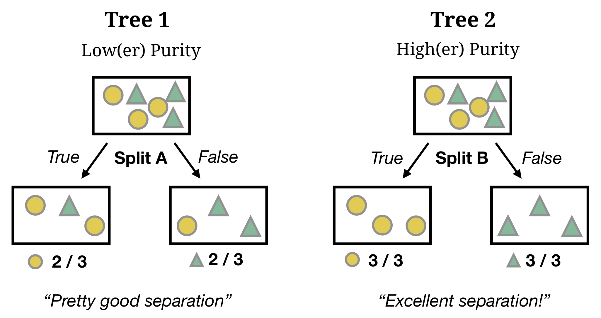
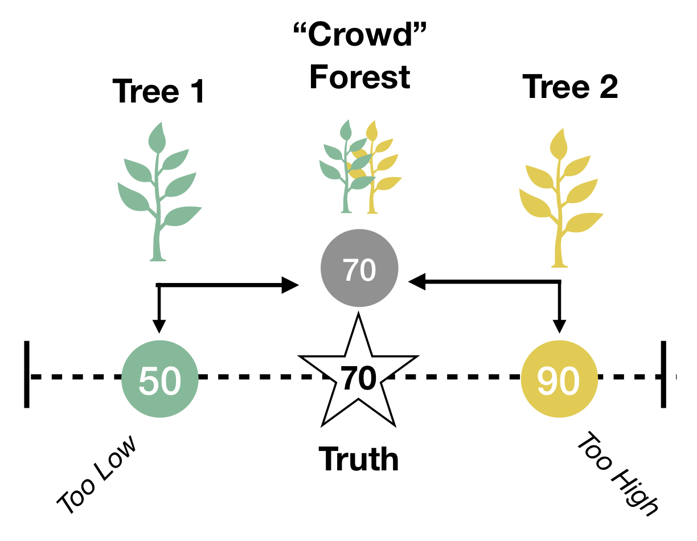

layout: true

<div class="my-footer"><span>
<a href="https://therbootcamp.github.io/"><font color="#7E7E7E">Applied Machine Learning with R, January 2019</font></a>
&emsp;&emsp;&emsp;&emsp;&emsp;&emsp;&emsp;&emsp;&emsp;&emsp;&emsp;&emsp;&emsp;&emsp;&emsp;&emsp;&emsp;&emsp;&emsp;&emsp;
<a href="https://therbootcamp.github.io/"><font color="#7E7E7E">www.therbootcamp.com</font></a>
</span></div> 

---

```{r, eval = TRUE, echo = FALSE, warning=F,message=F}
# Code to knit slides
require(caret)
baselers <- readr::read_csv("data/baselers.csv")
source("https://raw.githubusercontent.com/therbootcamp/therbootcamp.github.io/master/_materials/code/baselrbootcamp_palettes.R")
```

```{r setup, include=FALSE}
options(htmltools.dir.version = FALSE)
# see: https://github.com/yihui/xaringan
# install.packages("xaringan")
# see: 
# https://github.com/yihui/xaringan/wiki
# https://github.com/gnab/remark/wiki/Markdown
options(width=110)
options(digits = 4)

require(tidyverse)
```

# What is Machine Learning?

.pull-left45[

Machine learning (ML) is a <high>field of artificial intelligence</high> that uses <high>statistical techniques</high> to give computer systems the ability to <high>"learn"</high> (e.g., progressively improve <high>performance</high> on a specific task) <high>from data</high>, without being explicitly programmed. [Wikipedia](https://en.wikipedia.org/wiki/Machine_learning)

### What does this mean?

- Machine Learning is about making *data driven* decisions.

- ML algorithms try to automatically figure out which information is important and which is not.

- ML algorithms are always guided by a *formal definition of performance*.

]

.pull-right5[

<iframe width="560" height="315" src="https://www.youtube.com/embed/cNxadbrN_aI" frameborder="0" allow="accelerometer; autoplay; encrypted-media; gyroscope; picture-in-picture" allowfullscreen></iframe>
]

---

# What is Machine Learning?

.pull-left45[

Machine learning (ML) is a <high>field of artificial intelligence</high> that uses <high>statistical techniques</high> to give computer systems the ability to <high>"learn"</high> (e.g., progressively improve <high>performance</high> on a specific task) <high>from data</high>, without being explicitly programmed. [Wikipedia](https://en.wikipedia.org/wiki/Machine_learning)

### What does this mean?

- Machine Learning is about making *data driven* decisions.

- ML algorithms try to automatically figure out which information is important and which is not.

- ML algorithms are always guided by a *formal definition of performance*.

]

.pull-right5[

<br2>

```{r, echo = FALSE, fig.align = 'center', out.width = "100%", fig.cap = "<font size = 3>Wordstream.com</font>"}
knitr::include_graphics("https://wordstream-files-prod.s3.amazonaws.com/s3fs-public/styles/simple_image/public/images/machine-learning1.png?SnePeroHk5B9yZaLY7peFkULrfW8Gtaf&itok=yjEJbEKD")
```

]


---


# Essentials: 10 basic R lessons 

.pull-left4[
1. Everything is an object
2. <mono><-</mono> creates/changes objects
3. Everything happens through functions
4. Functions have (default) arguments
5. Find help with <mono>?</mono>
6. Data lives in data frames
7. 3 data types + factors
8. <high><mono>formula</mono> and <mono>data</mono> specify a model</high>
9. Use RStudio and projects
10. Use editor, shortcuts, auto-complete
]


.pull-right5[

```{r}
# Run a regression and store result in my_lm
my_lm <- lm(formula = income ~ age + height,
            data = baselers)
```
<br>
</img>
]


---

```{r, echo = FALSE}
set.seed(102)
x <- rnorm(10)
y <- .7 * x + rnorm(10, sd = .3) + 2

data <- data.frame(x, y)

mod <- lm(y ~ x, data = data)

great_intercept <- mod$coefficients[1]
great_slope <- mod$coefficients[2]

bad_intercept <- 3.5
bad_slope <- -.5

x0 = x
x1 = x
y0 = y
y1 = great_intercept + great_slope * x

dat_great <- data.frame(x0, x1, y0, y1)

x0 = x
x1 = x
y0 = y
y1 = bad_intercept + bad_slope * x

dat_bad <- data.frame(x0, x1, y0, y1)

library(tidyverse)

raw <- ggplot(dat_great, aes(x = x0, y = y0)) + geom_point(col = baselrbootcamp_cols("grey"), size = 2) +
  theme_minimal() +
  xlim(c(-2, 3)) +
  ylim(c(0, 5)) +
  labs(title = "Raw Data", 
       x = "Feature", y = "Criterion")

great_raw <- ggplot(dat_great, aes(x = x0, y = y0)) + geom_point(col = baselrbootcamp_cols("grey"), size = 2) +
  geom_abline(slope = great_slope, intercept = great_intercept, size = .5, linetype = 3) +
  theme_minimal() +
  xlim(c(-2, 3)) +
  ylim(c(0, 5)) +
  labs(title = "Model B", 
              subtitle = paste0("B0 = ", round(great_intercept, 2), ", B1 = ", round(great_slope, 2)),
       caption = paste("Mean Squared Error (MSE) = ?"),

       x = "Feature", y = "Criterion")

bad_raw <- ggplot(dat_bad, aes(x = x0, y = y0)) + geom_point(col = baselrbootcamp_cols("grey")) +
  geom_abline(slope = bad_slope, intercept = bad_intercept, size = .5, linetype = 3) +
  theme_minimal() +
  xlim(c(-2, 3)) +
  ylim(c(0, 5)) +
   labs(title = "Model A", 
        subtitle = paste0("B0 = ", round(bad_intercept, 2), ", B1 = ", round(bad_slope, 2)),
       caption = paste("Mean Squared Error (MSE) = ?"),
       x = "Feature", y = "Criterion")

great_err <- great_raw + 
  geom_linerange(data = dat_great, aes(x = x0, ymin = y0, ymax = y1), col = baselrbootcamp_cols("magenta")) +
  geom_point(data = dat_great, aes(x = x0, y = y1, size = 2), col = baselrbootcamp_cols("green"), pch = "X", size = 4) +
    labs(title = "Model B - Better", 
       caption = paste("Mean Squared Error (MSE) = ", round(mean((dat_great$y1 - dat_great$y0) ^ 2), 2)),
       x = "Feature", y = "Criterion")

bad_err <- bad_raw +
    geom_linerange(data = dat_bad, aes(x = x0, ymin = y0, ymax = y1), col = baselrbootcamp_cols("magenta")) +
    geom_point(data = dat_bad, aes(x = x0, y = y1, size = 2), col = baselrbootcamp_cols("green"), pch = "X", size = 4) +
   labs(title = "Model A - Worse", 
       caption = paste("Mean Squared Error (MSE) = ", round(mean((dat_bad$y1 - dat_bad$y0) ^ 2), 2)),
       x = "Feature", y = "Criterion")
```

# Regression Error

.pull-left45[

#### MAE: Mean Absolute Error

$$\large MAE = \frac{1}{n}\sum_{i=1}^{n} \lvert Prediction_{i} - Truth_{i} \rvert$$

> On average, how far are predictions away from true values?


#### MSE: Mean Squared Error

$$\large MSE = \frac{1}{n}\sum_{i=1}^{n}(Prediction_{i} - Truth_{i})^{2}$$
> On average, how far are predictions away from true values (squared!)?


]

.pull-right5[

```{r, fig.width = 6, fig.height = 4.8, out.width="100%", echo = FALSE}
bad_err +
  labs(subtitle = "Red lines are (absolute) errors", title = NULL)
```

]

---


# `train()`

.pull-left4[

`train()` is the workhorse fitting function of `caret`.

With just this one function, you can <high>fit any of 200+ models</high> just by changing the <high>method</high> argument!


|Argument|Description|
|:-----|:----|
|`form`|Formula specifying criterion|
|`data`|Training data|
|`method`| Model|
|`trControl`| Control parameters|

]


.pull-right55[

### Train a Regression model

Regression: `method = "glm"`

```{r, echo = TRUE, out.width = "90%", eval = FALSE, warning = FALSE}
# Fit a regression model predicting Price

mod <- train(form = income ~ ., # Formula
             data = baselers,   # Training data
             method = "glm",    # Regression
             trControl = ctrl)  # Control Parameters
```


]


---

# `train()`

.pull-left4[

`train()` is the workhorse fitting function of `caret`.

With just this one function, you can <high>fit any of 200+ models</high> just by changing the <high>method</high> argument!

|Argument|Description|
|:-----|:----|
|`form`|Formula specifying criterion|
|`data`|Training data|
|`method`| Model|
|`trControl`| Control parameters|
]


.pull-right55[

### Train a Random Forest model

Random Forest: `method = "rf"`

```{r, echo = TRUE, out.width = "90%", eval = FALSE, warning = FALSE}
# Fit a Random Forest model predicting Price

mod <- train(form = income ~ ., # Formula
             data = baselers,   # Training data
             method = "rf",     # Random Forests
             trControl = ctrl)  # Control Parameters
```

]

---

# Overfitting

```{r, fig.width = 8, fig.height = 3.5, echo = FALSE, eval = TRUE, warning = FALSE, dpi = 200}
set.seed(5)

N <- 40

iv <- rnorm(N, mean = 10, sd = 2)
truth <- iv 
noise <- rnorm(N, mean = 0, sd = 2)
obs <- truth + noise

data <- data.frame(iv, obs)


poly_pred <- map_dfc(.x = c(1, 19), .f = function(degree) {
  
  output <- data.frame(lm(obs ~ poly(iv, degree), data = data)$fitted.values)
  
  names(output) <- paste0("d", degree)
  
  return(output)

}) %>% mutate(id = 1:N,
              x = iv,
              obs = obs) %>%
  gather(Degree, pred, -id, -x, -obs) %>%
  mutate(`Training` = abs(pred - obs))


poly_pred <- poly_pred %>%
  mutate(Degree = case_when(Degree == "d1" ~ "Simple",
                            TRUE ~ "Complex"))


overfit_gg <- ggplot(poly_pred, aes(x = x, y = pred, col = Degree)) + 
  geom_line(size = 1.5) +
  geom_point(aes(x = x, y = obs), col = "black", pch = 21) +
  annotate("segment", x = 5, y = 5, xend = 15, yend = 15, col = "black", linetype = 4, size = 1) +
  xlim(5, 15) +
  ylim(5, 15) +
  labs(title = "Model overfitting",
       subtitle = "Dashed line is TRUE model") +
  theme_bw() +
    theme(legend.position="bottom") +
  scale_color_baselrbootcamp()
  
poly_pred <- poly_pred %>% mutate(

  obs_new = x + rnorm(1, mean = 0, sd = 2),
  `Testing` = abs(obs_new - pred)
  
)


poly_pred <- poly_pred %>%
  select(Degree, `Training`, `Testing`) %>%
  gather(phase, Error, -Degree)

agg <- poly_pred %>%
  group_by(Degree, phase) %>%
  summarise(Error = mean(Error)) %>%
  ungroup() %>%
  mutate(phase = factor(phase, levels = c("Training", "Testing"), ordered = TRUE))
 
fit_gg <- ggplot(agg, aes(x = phase, y = Error, fill = Degree)) +
  geom_bar(position = "dodge", stat = "identity") +
  labs(title = "Fitting versus Prediction Error",
       subtitle = "Smaller values are better!",
       x = "Modelling Phase") +  
  scale_y_continuous(limits=c(.75,1.25),oob = scales::rescale_none) +
  theme_bw() +
    theme(legend.position="bottom") +
  scale_fill_baselrbootcamp()

ggpubr::ggarrange(overfit_gg, fit_gg)
```

---

# Decision Trees

.pull-left4[

In [decision trees](https://en.wikipedia.org/wiki/Decision_tree), the criterion is modeled as a <high>sequence of logical YES or NO questions</high>.
<br><br>

<p align="center">
  
</p>

]

.pull-right55[

<high>Grow Decisions Trees</high> by splitting features that maximize *Node Purity*.
<br><br>
```{r, echo = FALSE, out.width = "100%"}

```

]

---

# Random Forest

.pull-left4[

In [Random Forest](https://en.wikipedia.org/wiki/Random_forest), the criterion is modeled as the <high>aggregate prediction of a large number of decision trees</high> each based on different features.
<br>

<p align="center">
  <br>
  <a href="https://medium.com/@williamkoehrsen">Source</a>
</p>

]

.pull-right55[

In Random Forests, we create a large set of <high>diverse trees</high> that can be aggregated into one <high>Wisdom of Crowds</high> judgment.

```{r, echo = FALSE, out.width = "80%"}

```

]

---
.pull-left5[

# 5 steps with caret

Step 0: Load training and test data (or create with `createDataPartition()`)

```{r, eval = FALSE}
data_train <- read_csv("1_Data/XXX_train.csv")
data_test <- read_csv("1_Data/XXX_test.csv")
```

Step 1: Define control parameters

```{r, eval = FALSE}
# Use method = "none" for no advanced fitting
ctrl <- trainControl(method = "none")
```

Step 2: Train model

```{r, eval = FALSE}
mod <- train(form = Y ~ .,  
             data = data_train,
             method = "My Favorite Model",
             trControl = ctrl,
             tuneGrid = expand.grid(mtry = 2))
```

]

.pull-right45[
<br><br><br><br><br>
Step 3: Explore

```{r, eval = FALSE}
mod            # Print object
mod$finalModel # Final model
```

Step 4: Predict 

```{r, eval = FALSE}
rpart_pred <- predict(object = mod, 
                      newdata = data_test)
```

Step 5: Evaluate prediction accuracy

```{r, eval = FALSE}
postResample(pred = rpart_pred, 
             obs = data_test$Y)
```

]

---

class: middle, center

<h1><a href=https://therbootcamp.github.io/appliedML_2019Jan/index.html>Schedule</a></h1>

