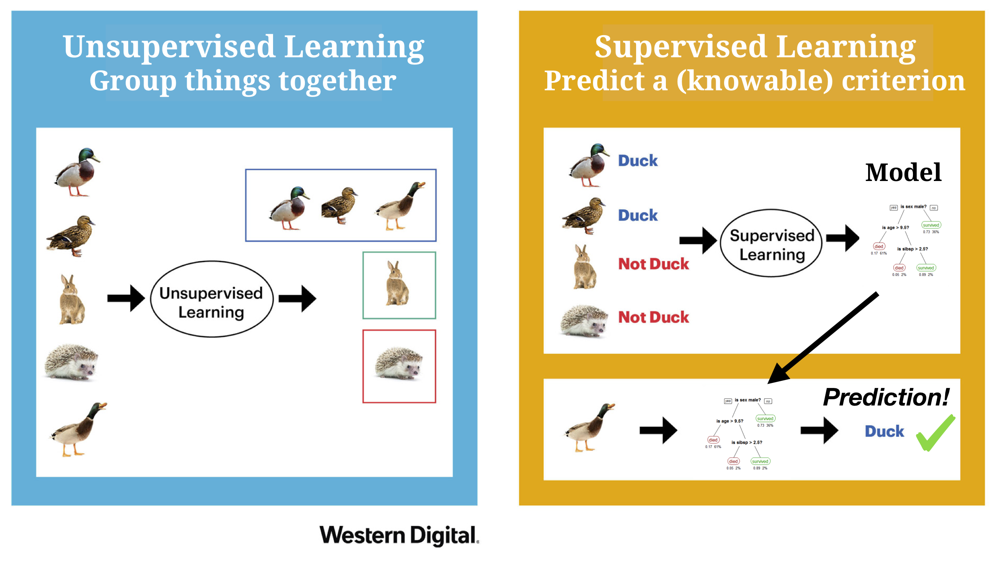

layout: true

<div class="my-footer"><span>
<a href="https://therbootcamp.github.io/"><font color="#7E7E7E">Applied Machine Learning with R, January 2019</font></a>
&emsp;&emsp;&emsp;&emsp;&emsp;&emsp;&emsp;&emsp;&emsp;&emsp;&emsp;&emsp;&emsp;&emsp;&emsp;&emsp;&emsp;&emsp;&emsp;&emsp;
<a href="https://therbootcamp.github.io/"><font color="#7E7E7E">www.therbootcamp.com</font></a>
</span></div> 

---
class: middle, center, question

```{r, eval = FALSE, echo = FALSE}
# Code to knit slides
xaringan::inf_mr('_sessions/D1S2_Wrangling/Wrangling.Rmd')
baselers <- read_csv("https://raw.githubusercontent.com/therbootcamp/baselers/master/inst/extdata/baselers.txt")
```

```{r setup, include=FALSE}
options(htmltools.dir.version = FALSE)
options(width=110)
options(digits = 4)
library(tidyverse)
baselers <- read_csv("https://raw.githubusercontent.com/therbootcamp/baselers/master/inst/extdata/baselers.txt")
```


# What do you think?

<br><br><br>
No Googling :)

---


.pull-left6[

# What is Machine Learning?

Machine learning (ML) is a <high>field of artificial intelligence</high> that uses <high>statistical techniques</high> to give computer systems the ability to <high>"learn"</high> (e.g., progressively improve <high>performance</high> on a specific task) <high>from data</high>, without being explicitly programmed. [Wikipedia](https://en.wikipedia.org/wiki/Machine_learning)


]

.pull-right4[

<br><br>

```{r, echo = FALSE, fig.align = 'center', out.width = "90%", fig.cap = "<font size = 4>www.towardsdatascience.com</font>"}
knitr::include_graphics("https://encrypted-tbn0.gstatic.com/images?q=tbn:ANd9GcSXjr_if5M3PSjd7Im1cLUNjqwKNd3bxjL9ym_MrOND7HF3nd1Z8w")
```

]

---

.pull-left6[

# What is Machine Learning?

Machine learning (ML) is a <high>field of artificial intelligence</high> that uses <high>statistical techniques</high> to give computer systems the ability to <high>"learn"</high> (e.g., progressively improve <high>performance</high> on a specific task) <high>from data</high>, without being explicitly programmed. [Wikipedia](https://en.wikipedia.org/wiki/Machine_learning)

## What does this mean?

- Machine Learning is about making *data driven* decisions.

- To do machine learning, you need (clean, relevant) data!

- ML algorithms try to automatically figure out which information is important and which is not.

- ML algorithms are always guided by a *formal definition of performance*.

]

.pull-right4[

<br><br>

```{r, echo = FALSE, fig.align = 'center', out.width = "90%", fig.cap = "<font size = 4>www.towardsdatascience.com</font>"}
knitr::include_graphics("https://encrypted-tbn0.gstatic.com/images?q=tbn:ANd9GcSXjr_if5M3PSjd7Im1cLUNjqwKNd3bxjL9ym_MrOND7HF3nd1Z8w")
```

]


---

.pull-left6[

# Examples

### Predicting Heart Attacks

You are an intake nurse at an emergency room.

A patient comes in complaining of chest pain and thinks they are having a heart attack

*How do you decide whether or not the patient is really having a heart attack?*

### Predicting sales

You are an analyst at a retail corporation.

The executive team is considering whether or not to open a new retail location in Basel.

*How can you predict what the sales of the new store would be?*

]

.pull-right35[

<br>
```{r, echo = FALSE, fig.align = 'center', out.width = "70%", fig.cap = "<font size = 4>www.ucsf.edu</font>"}
knitr::include_graphics("https://www.ucsf.edu/sites/default/files/styles/2014_inline_5-col/public/fields/field_insert_file/news/Man-Chest-Pain-Doctor.jpg?itok=nRgCK8R_")
```

```{r, echo = FALSE, fig.align = 'center', out.width = "85%", fig.cap = "<font size = 4>location.ch</font>"}
knitr::include_graphics("http://www.location.ch/assets/images/f/Basel_Freie_Strasse_1_900x600-8f38558f.jpg")
```

]

---


.pull-left6[

# Solution 1: Intuition


### What are potential problems with intuition?

Many decisions are based on an individual's intuitive 'gut' judgment.

> "I have a feeling this patient is having a heart attack" <br>

> "Sales will be at least 100,000 CHF per month, trust me on this."

<br><br>

]

.pull-right35[

<br>
```{r, echo = FALSE, fig.align = 'center', out.width = "70%", fig.cap = "<font size = 4>www.ucsf.edu</font>"}
knitr::include_graphics("https://www.ucsf.edu/sites/default/files/styles/2014_inline_5-col/public/fields/field_insert_file/news/Man-Chest-Pain-Doctor.jpg?itok=nRgCK8R_")
```

```{r, echo = FALSE, fig.align = 'center', out.width = "85%", fig.cap = "<font size = 4>location.ch</font>"}
knitr::include_graphics("http://www.location.ch/assets/images/f/Basel_Freie_Strasse_1_900x600-8f38558f.jpg")
```

]

---


.pull-left6[

# Solution 1: Intuition


### What are potential problems with intuition?

- Might not tell you anything about *why* it makes a prediction.

- Could be based on reasons other than accuracy (e.g.; self protection)

- Without rigorous testing, impossible to know if <high>critical information is being ignored</high>.

- If the decision isn't programmed, it might be <high>impossible to replicate</high> (and improve) in the future.

- Intuition is rarely consistently tracked and evaluated. When wrong, intuition can always be defended 'in hindsight' (ML too!).

]

.pull-right35[

<br>
```{r, echo = FALSE, fig.align = 'center', out.width = "70%", fig.cap = "<font size = 4>www.ucsf.edu</font>"}
knitr::include_graphics("https://www.ucsf.edu/sites/default/files/styles/2014_inline_5-col/public/fields/field_insert_file/news/Man-Chest-Pain-Doctor.jpg?itok=nRgCK8R_")
```

```{r, echo = FALSE, fig.align = 'center', out.width = "85%", fig.cap = "<font size = 4>location.ch</font>"}
knitr::include_graphics("http://www.location.ch/assets/images/f/Basel_Freie_Strasse_1_900x600-8f38558f.jpg")
```

]


---
class: middle, center

# One very influential world leader really trusts his intuition...

---

```{r, fig.align = 'center', out.width = "100%", echo = FALSE}

```

---

```{r, fig.align = 'center', out.width = "100%", echo = FALSE}

```

---

# Solution 2: Data-Driven Machine Learning

.pull-left6[

Here's how a data-driven, ML approach would look:


```{r, echo = FALSE, out.width = "70%", fig.align='center'}
knitr::include_graphics("image/heartdisease_data_ss.jpg")
```


- Based on historical <high>data</high> from past patients <high>at this hospital</high>...
- A <high>regression model</high> ...
- Using the patient's <high>age, cholesterol level, and ecg</high>...
- <high>Predicts</high> the probability that this patient is having a heart attack is only <high>20%</high>.

] 

.pull-right35[

```{r, echo = FALSE, fig.align = 'center', out.width = "100%", fig.cap = "<font size = 4>gstatic.com</font>"}
knitr::include_graphics("https://encrypted-tbn0.gstatic.com/images?q=tbn:ANd9GcS795QtyFgYH6vRDqhlhu9WtQKLJw11iNyAfGteNoiaTzZE3f-v")
```

```{r, echo = FALSE, fig.align = 'center', out.width = "100%", fig.cap = "<font size = 4>WK Digital</font>"}
knitr::include_graphics("https://wkdigital.com.au/wp-content/uploads/2016/06/How-To-Profile-Your-Customer.jpg")
```

] 


---

# Solution 2: Data-Driven Machine Learning

.pull-left6[

### What are the benefits of ML?

- Algorithms fit to your past data can tell you which variables are important and which are not.

- Make explicit, quantitative predictions of variables of interest.

- Many can give you probability estimates, and estimated errors, rather than single decisions or point estimates.

- Can reveal novel insights about your data!

- Can be programmed and automated.


] 

.pull-right35[

```{r, echo = FALSE, fig.align = 'center', out.width = "100%", fig.cap = "<font size = 4>gstatic.com<font>"}
knitr::include_graphics("https://encrypted-tbn0.gstatic.com/images?q=tbn:ANd9GcS795QtyFgYH6vRDqhlhu9WtQKLJw11iNyAfGteNoiaTzZE3f-v")
```

```{r, echo = FALSE, fig.align = 'center', out.width = "100%", fig.cap = "<font size = 4>WK Digital</font>"}
knitr::include_graphics("https://wkdigital.com.au/wp-content/uploads/2016/06/How-To-Profile-Your-Customer.jpg")
```

] 


---

```{r, fig.align = 'center', out.width = "100%", echo = FALSE}

```


---


.pull-left5[

# Data Terminology


|Term| Definition| Example|
|:------|:-----|:------|
|Data (Tidy)|Data represented in a rectangular format with rows and columns|Excel spreadsheet, .`csv`|
|Case|A specific case of data|A patient, a site|
|Feature|An individual, measurable property of cases|Age, temperature, country|
|Criterion|Something you want to predict|Total sales, success (yes or no)|

]


.pull-right5[

<br><br><br><br>
```{r, echo = FALSE, fig.align = 'center', out.width = "100%"}

```


]


---

# What are the steps of machine learning?

```{r, echo = FALSE, fig.align = 'center', out.width = "100%", fig.cap = "<font size = 4>Medium.com</font>"}
knitr::include_graphics("https://cdn-images-1.medium.com/max/1600/1*_QGyIwpgq831xI54cIe_GQ.jpeg")
```


---

# What types of machine learning tasks are there?

.pull-left4[

There are many types of machine learning tasks, each of which call for different models

Three general categories

|Type|Example|
|:----|:-----|
|Reinforcement Learning|Robot navigation, game playing AI|
|Unsupervised|Customer segmentation|
|Supervised|Classification, regression|

In this course, we focus on <high>Supervised</high> tasks

]

.pull-right55[

```{r, echo = FALSE, fig.align = 'center', out.width = "100%", fig.cap = "<font size = 4>Wordstream.com</font>"}
knitr::include_graphics("https://wordstream-files-prod.s3.amazonaws.com/s3fs-public/styles/simple_image/public/images/machine-learning1.png?SnePeroHk5B9yZaLY7peFkULrfW8Gtaf&itok=yjEJbEKD")
```

]


---

# What types of machine learning tasks are there?

.pull-left4[

There are many types of machine learning tasks, each of which call for different models

Three general categories

|Type|Example|
|:----|:-----|
|<high>Reinforcement Learning</high>|Robot navigation, game playing AI|
|Unsupervised|Customer segmentation|
|Supervised|Classification, regression|

In this course, we focus on <high>Supervised</high> tasks

]

.pull-right55[

### Reinforcement Learning

```{r, echo = FALSE, fig.align = 'center', out.width = "45%", fig.cap = "<font size = 4>towardsdatascience.com</font>"}
knitr::include_graphics("https://cdn-images-1.medium.com/max/1600/1*6sE---UY4iiCDPA2kdYQkg.gif")
```

```{r, echo = FALSE, fig.align = 'center', out.width = "45%", fig.cap = "<font size = 4>MIT Technology Review</font>"}
knitr::include_graphics("https://cdn.technologyreview.com/i/images/alphagotopper2.jpg?sw=1200")
```

]

---

# What types of machine learning tasks are there?

.pull-left4[

There are many types of machine learning tasks, each of which call for different models

Three general categories

|Type|Example|
|:----|:-----|
|Reinforcement Learning|Robot navigation, game playing AI|
|<high>Unsupervised</high>|Customer segmentation|
|Supervised|Classification, regression|

In this course, we focus on <high>Supervised</high> tasks


]

.pull-right55[

### Unsupervised
```{r, echo = FALSE, fig.align = 'center', out.width = "100%", fig.cap = "<font size = 4>iotforall.com</font>"}
knitr::include_graphics("https://www.iotforall.com/wp-content/uploads/2018/01/Screen-Shot-2018-01-17-at-8.10.14-PM.png")
```

]


---

# What types of machine learning tasks are there?

.pull-left4[

There are many types of machine learning tasks, each of which call for different models

Three general categories

|Type|Example|
|:----|:-----|
|Reinforcement Learning|Robot navigation, game playing AI|
|Unsupervised|Customer segmentation|
|<high>Supervised</high>|Classification, regression|

In this course, we focus on <high>Supervised</high> tasks


]

.pull-right55[

### Supervised

```{r, echo = FALSE, fig.cap = "<font size = 4>medium.com</font>"}
knitr::include_graphics("https://cdn-images-1.medium.com/max/1600/1*ASYpFfDh7XnreU-ygqXonw.png")
```

]


---

# What types of machine learning tasks are there?

.pull-left4[

There are many types of machine learning tasks, each of which call for different models

Three general categories

|Type|Example|
|:----|:-----|
|Reinforcement Learning|Robot navigation, game playing AI|
|Unsupervised|Customer segmentation|
|<high>Supervised</high>|Classification, regression|

In this course, we focus on <high>Supervised</high> tasks


]

.pull-right55[

### Unsupervised vs. Supervised

```{r, echo = FALSE}
knitr::include_graphics("https://leonardoaraujosantos.gitbooks.io/artificial-inteligence/content/Images/supervised_unsupervised.png")
```
<font size = 4>leonardoaraujosantos.gitbooks.io</font>
]

---

# What types of machine learning tasks are there?

.pull-left4[

There are many types of machine learning tasks, each of which call for different models

Three general categories

|Type|Example|
|:----|:-----|
|Reinforcement Learning|Robot navigation, game playing AI|
|Unsupervised|Customer segmentation|
|<high>Supervised</high>|Classification, regression|

In this course, we focus on <high>Supervised</high> tasks


]

.pull-right55[

### Unsupervised vs. Supervised

```{r, echo = FALSE, fig.cap = "<font size = 4>Western Digital (adapted)</font>"}

```

]

---
class: center, middle

# What is a model?

<font size = 6, color = "white">.</font>
<font size = 6, color = "white">.</font>


---
class: center, middle

# What is a model?

<font size = 6>It's not magic.</font><br>


---
class: center, middle

# What is a model?

<font size = 6>It's not magic.</font><br><br>

<font size = 6> A model is a <high>mathematical</high> (computational) representation of data.</font>

---
class: center, middle

# What is a model?

<font size = 6>It's not magic.</font><br><br>

<font size = 6>A model is a <high>mathematical</high> (computational) representation of data.</font> <br><br>

<font size = 6>That can be <high>programmed</high>, and used to understand, and <high>predict relationships</high> between data</font>

---

# Three of the models we will work with

```{r, echo = FALSE}
knitr::include_graphics("image/three_models.png")
```

---

.pull-left6[

# Why do we need a model at all?

### Theoretical

*To <high>learn something</high> from the data*

- Which features are most <high>important</high> in predicting the criterion and which can be safely ignored?
- What is the <high>relationship</high> between features and the criterion?
    - Strong? Weak? Postive? Negative?
- Make <high>predictions</high> for new data.
    - I've got a new patient, how likely is it that (s)he is having a heart attack?
- Improve predictions over time with new data.

### Practical

- Need a computational / mathematical representation of the data that can be programmed and automated.

> Verbal descriptions of data are nice, but they aren't models.

]

.pull-right4[

<br>

```{r, echo = FALSE, fig.align = 'center', out.width = "100%"}
knitr::include_graphics("https://github.com/therbootcamp/appliedML_2019Jan/blob/master/_sessions/Fitting/image/data_to_ml.jpg?raw=true")
```

]


---
class: middle, center

<h1>R you ready?</h1>

<h1><a href=https://therbootcamp.github.io/appliedML_2019Jan/index.html>Schedule</a></h1>


